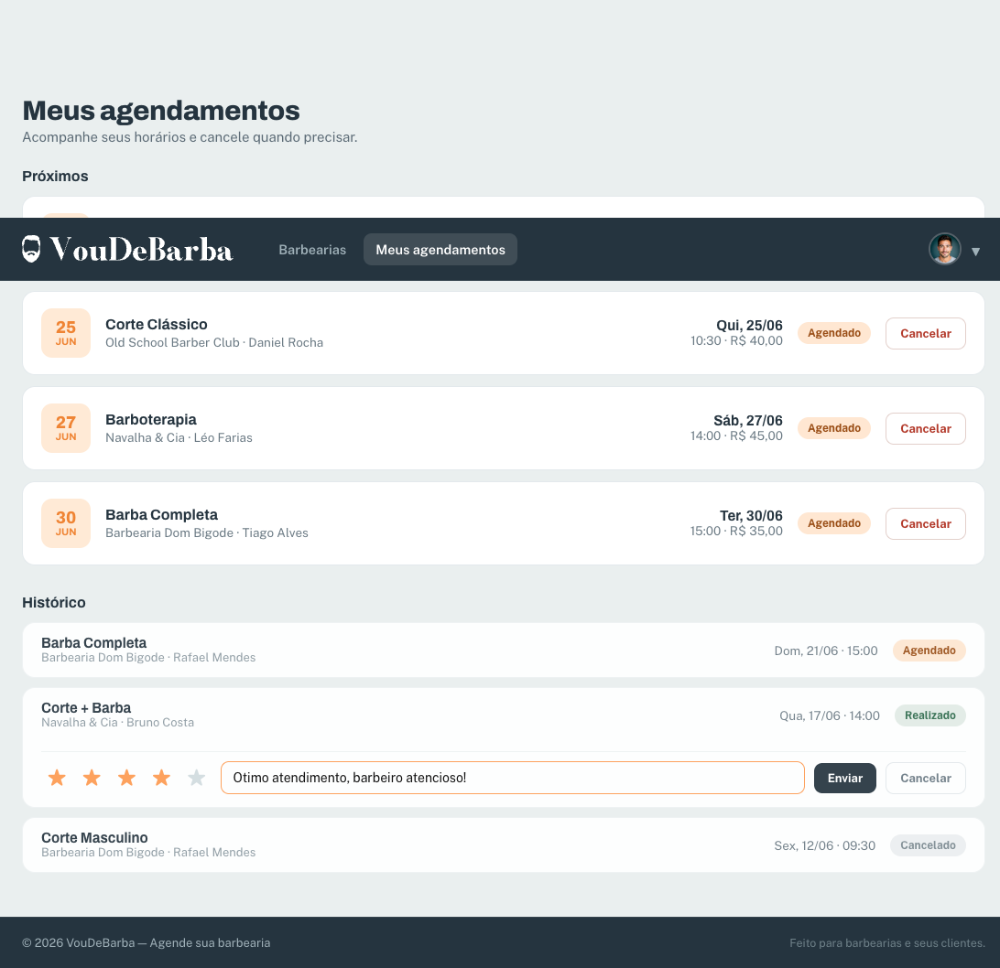
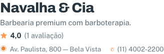
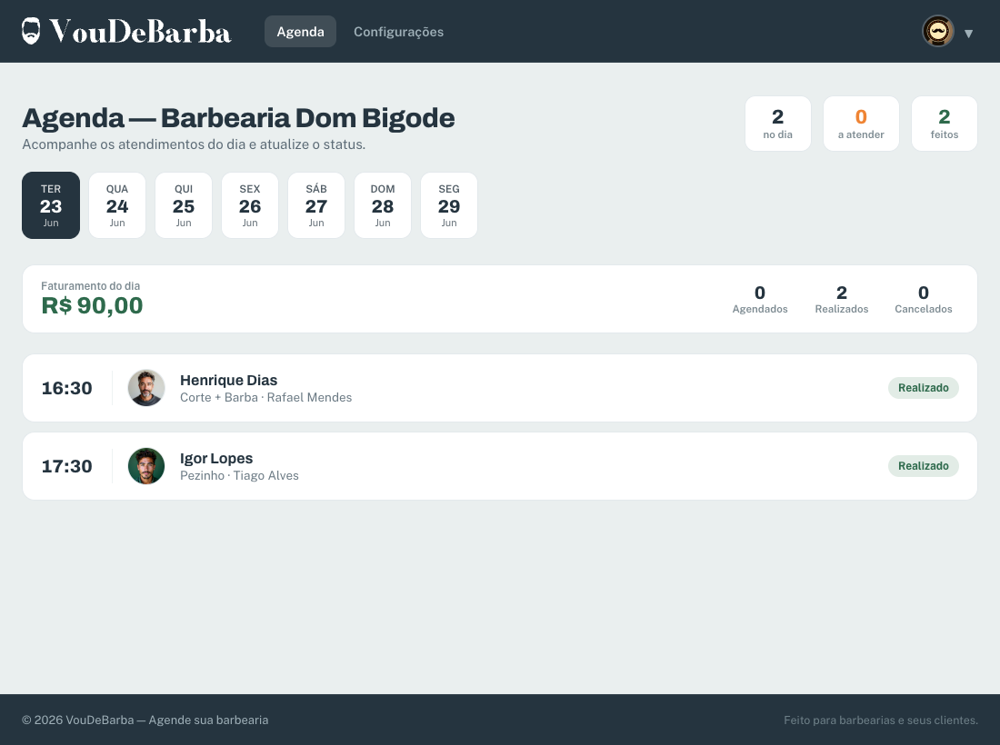
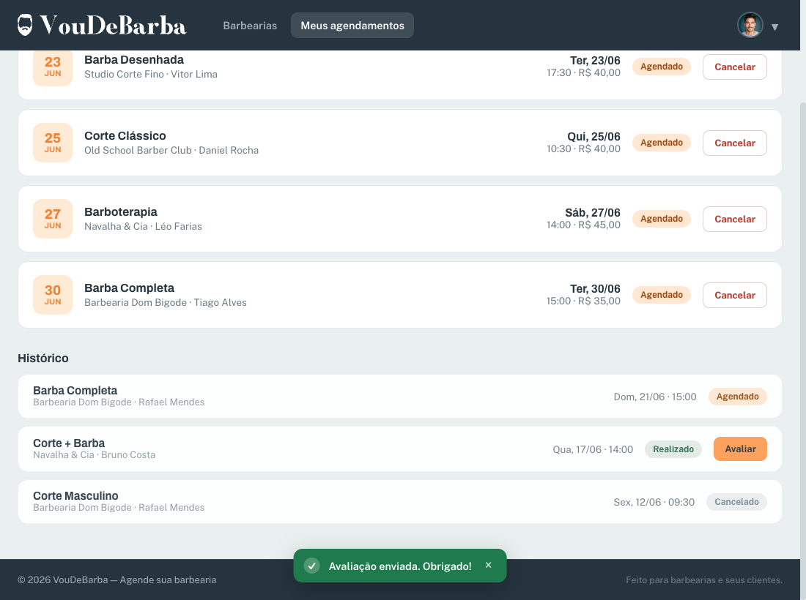
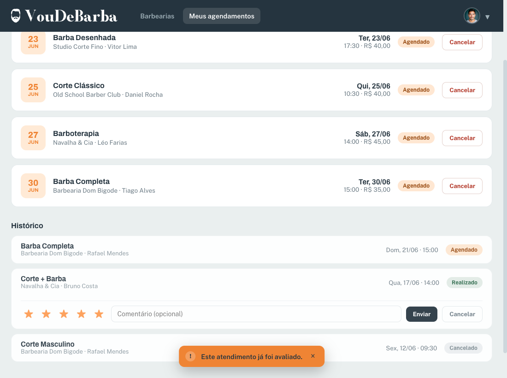

# Tutorial passo a passo — Avaliação do atendimento + Faturamento do dia

> Este tutorial foi feito para quem está começando. Não pulamos nenhum passo.
> Se você seguir cada passo **exatamente como está escrito**, no fim tudo funciona.
> Leia com calma. Não tenha pressa. Copie os trechos exatamente como aparecem aqui.

---

## 0. Preparando o computador (faça isso antes de tudo)

Antes de mexer no código, você precisa deixar o computador pronto. Esta seção ensina do zero: instalar os programas, baixar o projeto, ligar o backend e o frontend, e criar um espaço seguro para trabalhar. Não pule nada aqui — sem isso, o resto do tutorial não roda.

### 0.1. Os programas que você vai instalar

Você precisa de quatro programas. Vou explicar para que serve cada um e como instalar.

**1) Git** — é o programa que baixa o projeto da internet e guarda o histórico das suas mudanças. Pense nele como um "controle de versão": ele lembra de tudo que você alterou e deixa você voltar atrás se errar.

- Windows: baixe em https://git-scm.com/download/win e instale clicando em "Avançar" até o fim.
- macOS: rode `xcode-select --install` no Terminal, ou baixe em https://git-scm.com/download/mac.
- Linux (Ubuntu/Debian): rode `sudo apt install git`.

Para conferir se instalou, abra o terminal e digite:

```bash
git --version
```

Se aparecer algo como `git version 2.43.0`, deu certo.

**2) Python 3.11 ou mais novo** — é a linguagem em que o backend (o "servidor" que guarda os dados) foi escrito. Baixe em https://www.python.org/downloads/ e instale.

> ⚠️ **Atenção importante:** o projeto tem um arquivo chamado `.python-version` que pede o Python 3.14. Essa versão pode nem existir ainda na sua máquina. Não se preocupe: mais adiante você vai criar o ambiente do projeto usando o **Python 3.11**, que é estável e funciona. Na hora de criar a venv (passo 0.5), use `python3.11` no lugar de `python` se tiver mais de uma versão instalada.

Para conferir a versão instalada:

```bash
python --version
```

(No Windows às vezes o comando é `py --version`; no macOS/Linux costuma ser `python3 --version`.) Você precisa ver `Python 3.11.x` ou maior.

**3) Bun** — é o programa que cuida da parte do frontend (a "tela", o que aparece no navegador). Ele baixa as bibliotecas e roda o site enquanto você desenvolve. Neste projeto, o Bun é o programa oficial para isso — **não use npm**.

- macOS/Linux: rode `curl -fsSL https://bun.sh/install | bash`.
- Windows: rode `powershell -c "irm bun.sh/install.ps1 | iex"`.

Para conferir:

```bash
bun --version
```

Se aparecer um número de versão (ex.: `1.1.20`), está pronto.

**4) VSCode** — é o editor de código onde você vai escrever e ler os arquivos. Baixe em https://code.visualstudio.com/ e instale. É de graça.

### 0.2. Baixar o projeto (clonar o repositório)

"Clonar" quer dizer baixar uma cópia completa do projeto para o seu computador. Abra o terminal numa pasta onde você queira guardar o projeto e rode:

```bash
git clone https://github.com/cost4c/voudebarba.git
```

Isso cria uma pasta `voudebarba` com tudo dentro. Entre nela:

```bash
cd voudebarba
```

Abra essa pasta no VSCode (menu **File → Open Folder**, ou rode `code .` no terminal).

### 0.3. Criar um espaço seguro para trabalhar (uma branch)

Antes de escrever qualquer código, vamos criar uma **branch**. Uma branch é como uma cópia paralela do projeto onde você trabalha sem bagunçar a versão principal (chamada `main`). Por quê? Porque se algo der errado, você simplesmente apaga a branch e a versão principal continua intacta. É a sua rede de segurança. Rode:

```bash
git checkout -b minha-feature
```

Esse comando cria a branch `minha-feature` e já te coloca dentro dela. Tudo que você fizer daqui em diante fica guardado nela.

### 0.4. Instalar as bibliotecas do frontend

O frontend depende de várias bibliotecas prontas. O Bun baixa todas de uma vez. A partir da pasta `frontend/`:

```bash
bun install
```

Espere terminar (pode demorar um pouco na primeira vez).

### 0.5. Criar o ambiente do backend (a venv) e instalar as bibliotecas

A **venv** (ambiente virtual) é uma "caixinha" isolada onde ficam só as bibliotecas deste projeto, sem misturar com o resto do seu computador. Isso evita conflitos. A partir da pasta `backend/`, crie a venv usando o Python 3.11:

```bash
python3.11 -m venv .venv
```

(Se na sua máquina o comando do Python 3.11 for outro, ajuste. O importante é que a venv use o 3.11, não a versão do `.python-version`.)

Agora **ative** a venv (ligar a caixinha):

```bash
# macOS / Linux:
source .venv/bin/activate
# Windows (PowerShell):
.venv\Scripts\Activate.ps1
```

Quando ativada, aparece `(.venv)` no começo da linha do terminal. Com ela ligada, instale as bibliotecas do projeto:

```bash
pip install -r requirements.txt
```

### 0.6. Extensões do VSCode (instale e ative cada uma)

Extensões deixam o VSCode mais esperto: ele entende o código, avisa erros e fica mais bonito. Abra o VSCode, clique no ícone de blocos na barra lateral (Extensions) e instale estas, uma a uma. Ao lado de cada nome explico em uma linha para que serve:

- **Python** — dá suporte básico à linguagem Python (rodar, depurar, reconhecer arquivos `.py`).
- **Pylance** — corretor inteligente que entende os tipos do Python e sublinha erros antes de você rodar.
- **Python Debugger** — deixa você pausar o código e olhar o que está acontecendo passo a passo.
- **Python Environments** — ajuda a escolher e gerenciar a venv certa dentro do editor.
- **ESLint** — aponta problemas no código do frontend (JavaScript/TypeScript) enquanto você digita.
- **SQLite3 Editor** — abre e mostra o banco de dados do projeto direto no editor, sem programa extra.
- **vscode-icons** — coloca ícones bonitos nas pastas e arquivos, fica mais fácil de achar as coisas.
- **HTML CSS Support** — completa nomes de classes e tags ao escrever HTML/CSS.

> Dica: depois de instalar a extensão Python, abra qualquer arquivo `.py` e, no canto inferior do VSCode, escolha o interpretador da `.venv` que você criou no passo 0.5.

### 0.7. Conferir se tudo está de pé

Com a venv ativada, ligue o backend a partir da pasta `backend/`:

```bash
.venv/bin/python main.py
```

E, em **outro terminal**, ligue o frontend a partir da pasta `frontend/`:

```bash
bun run dev
```

Se o backend subir em `http://localhost:8415` e o frontend em `http://localhost:5185`, está tudo pronto. Agora sim podemos começar.

---

## 1. O que você vai construir

Você vai criar **duas funcionalidades** novas no app **VouDeBarba**. Cada uma vai do banco de dados até a tela do usuário. Quando uma funcionalidade percorre todas essas camadas — do servidor que guarda os dados até o que o usuário vê — chamamos isso de "full-stack" (ou "ponta a ponta"):

- **(A) Avaliação do atendimento pelo cliente.** Depois que um agendamento vira **Realizado**, o cliente poderá dar uma **nota de 1 a 5** e um **comentário** para aquele atendimento. A barbearia passa a exibir a **média das notas** na sua página de detalhe.
- **(B) Faturamento do dia.** O dono da barbearia verá, no topo da sua agenda, um **resumo do dia**: quantos agendamentos estão Agendados / Realizados / Cancelados e o **total faturado** (soma do preço dos serviços dos agendamentos Realizados naquele dia).

No fim, você terá entregue todos estes itens. Aqui aparece a palavra **endpoint**: um endpoint é simplesmente um "endereço" da API que o frontend chama para fazer ou buscar alguma coisa (por exemplo, "registrar uma avaliação" ou "pegar os dados de uma barbearia"). Cada endpoint tem um caminho (a URL) e um verbo (`GET` para buscar, `POST` para criar, e por aí vai).

Resultado final, em lista:

- [ ] Uma tabela nova `avaliacao` criada automaticamente quando o backend sobe.
- [ ] Endpoint `POST /api/agendamentos/{id}/avaliar` que registra a nota do cliente.
- [ ] A média de avaliações aparecendo no `GET /api/barbearias/{id}` (detalhe da barbearia).
- [ ] Um botão **Avaliar** nos cartões de atendimentos **Realizados** da tela "Meus agendamentos".
- [ ] A média (ex.: "⭐ 4,7") aparecendo na tela de detalhe da barbearia.
- [ ] Endpoint `GET /api/barbearia/agenda/resumo?data=YYYY-MM-DD` que devolve as contagens por status e o total faturado.
- [ ] Um card de **Resumo do dia** no topo da tela Agenda (perfil Barbearia).

---

## 2. Ligar o backend e o frontend para testar

Para testar, o app precisa estar ligado. São **dois programas rodando ao mesmo tempo** (você vai abrir dois terminais).

### 2.1. Subir o backend

Lembra que o `.python-version` pede uma versão do Python que pode não existir na sua máquina? Por isso, **sempre** use o Python que está dentro do `.venv` que você criou na seção 0. A partir da pasta `backend/`:

```bash
backend/.venv/bin/python main.py
```

Isso liga a API em `http://localhost:8415`. Tem uma página de documentação interativa (o Swagger) em `http://localhost:8415/docs`. Você vai usar bastante para testar a API sem precisar do frontend.

> ⚠️ Não rode o container Docker local ao mesmo tempo: os dois brigam pela porta 8415.

### 2.2. Subir o frontend

Em **outro terminal**, a partir da pasta `frontend/`:

```bash
bun run dev
```

Isso liga o Vite em `http://localhost:5185`. O Vite já redireciona os pedidos de `/api` para o backend automaticamente, então você não vai ter aquele erro chato de CORS (bloqueio de pedidos entre endereços diferentes).

### 2.3. Logins de teste (senha demo `1234aA@#`)

- Cliente: `cliente@voudebarba.com`
- Dono de barbearia: `dom@voudebarba.com` (também `navalha@`, `oldschool@`, `studio@`)

Guarde esses logins: você usa o **cliente** para testar a avaliação e o **dono** para testar o faturamento.

---

## 3. As camadas e a ordem em que vamos programar

Este projeto é organizado em **camadas** — cada uma cuida de uma parte. No **backend** a ordem é: `Routes → DTOs → Repos → SQL → Banco`. No **frontend**: `api.ts → types.ts/schemas.ts → página → router.tsx`.

A regra de ouro é: **comece por baixo e vá subindo**. Primeiro a parte mais perto do banco de dados, depois vá subindo até chegar na tela. Por quê? Porque cada camada **usa** a de baixo. Se você começar pela tela, não vai ter nada para a tela chamar. Mas se começar pelo banco, quando chegar na tela tudo que ela precisa já vai existir — e você consegue testar pelo `/docs` antes mesmo de mexer no React.

Vão aparecer dois termos novos aqui:

- **DTO** (Data Transfer Object, ou "objeto de transferência de dados") é só um pacotinho que carrega dados de um lado para o outro. O **DTO de entrada** define o formato do que o cliente manda; o **Response** (DTO de saída) define o formato do que o servidor devolve.
- **CRUD** é a sigla das quatro operações básicas de qualquer dado: **C**riar, **L**er (Read), **A**tualizar (Update) e **D**eletar. Quando falamos "as operações de CRUD da avaliação", são essas ações sobre o banco.

Ordem que vamos seguir:

1. **SQL** (textos prontos com os comandos `CREATE TABLE`, `INSERT`, `SELECT`…).
2. **Model** (a entidade `Avaliacao`, escrita como `@dataclass`).
3. **Repo** (as funções que conversam com o banco).
4. **Registrar a tabela quando o app liga** (`main.py` → lista `TABELAS`). ← este é o passo que quase todo mundo esquece.
5. **DTO de entrada** (confere se a nota está entre 1 e 5 antes de aceitar).
6. **Response** (o formato de saída que o frontend recebe).
7. **Rota** (o endpoint em si).
8. **Registrar a rota quando o app liga** — só é preciso quando você cria um módulo de rotas novo. Aqui vamos aproveitar rotas que já existem, então não precisa (explico na hora certa).
9. **Frontend**: `types.ts` → `schemas.ts` → página/tela.

Vamos fazer a **funcionalidade (A) Avaliação** inteira primeiro e depois a **(B) Faturamento**. Assim você fecha um ciclo completo antes de começar o outro.

---

# PARTE A — Avaliação do atendimento

## A.1. SQL da avaliação — ARQUIVO NOVO

**Caminho:** `backend/sql/avaliacao_sql.py`

Aqui ficam só os **textos de SQL** (os comandos do banco de dados), um para cada operação. Nada de lógica de programação. Repare nos detalhes que copiamos do padrão do projeto (dê uma olhada em `backend/sql/agendamento_sql.py` para comparar):

- `id INTEGER PRIMARY KEY AUTOINCREMENT` — o banco gera um número de identificação único e crescente para cada linha.
- `agendamento_id` é **UNIQUE** (único): garante que um mesmo agendamento só pode ser avaliado **uma vez**.
- `criado_em TIMESTAMP DEFAULT CURRENT_TIMESTAMP` — guarda automaticamente a data e hora em que a avaliação foi criada.
- Chaves estrangeiras (`FOREIGN KEY`) com `ON DELETE CASCADE` — ligam a avaliação ao agendamento e à barbearia; se um deles for apagado, a avaliação some junto.
- Os `?` são "espaços reservados": os valores de verdade entram depois, separados. Nunca monte o SQL juntando texto (f-string), porque isso abre brecha para ataques de SQL injection (quando alguém injeta comando malicioso pelo campo de texto).

```python
CRIAR_TABELA = """
CREATE TABLE IF NOT EXISTS avaliacao (
    id INTEGER PRIMARY KEY AUTOINCREMENT,
    agendamento_id INTEGER NOT NULL UNIQUE,
    barbearia_id INTEGER NOT NULL,
    nota INTEGER NOT NULL,
    comentario TEXT,
    criado_em TIMESTAMP DEFAULT CURRENT_TIMESTAMP,
    FOREIGN KEY (agendamento_id) REFERENCES agendamento(id) ON DELETE CASCADE,
    FOREIGN KEY (barbearia_id) REFERENCES barbearia(id) ON DELETE CASCADE
)
"""

INSERIR = """
INSERT INTO avaliacao (agendamento_id, barbearia_id, nota, comentario)
VALUES (?, ?, ?, ?)
"""

OBTER_POR_AGENDAMENTO = "SELECT * FROM avaliacao WHERE agendamento_id = ?"

# Média das notas de uma barbearia + quantas avaliações existem.
# AVG e COUNT vêm NULL/0 quando não há nenhuma avaliação ainda — tratamos isso no repo.
MEDIA_POR_BARBEARIA = """
SELECT AVG(nota) AS media, COUNT(*) AS total
FROM avaliacao
WHERE barbearia_id = ?
"""
```

**Por que usar `UNIQUE`?** Se o cliente tentar avaliar o mesmo atendimento duas vezes, o próprio banco recusa. Vamos checar isso também na rota, mas o `UNIQUE` é a rede de segurança final — se a checagem da rota falhar por algum motivo, o banco ainda barra.

---

## A.2. Model da avaliação — ARQUIVO NOVO

**Caminho:** `backend/model/avaliacao_model.py`

O model representa a "coisa" com que o sistema trabalha — neste caso, uma avaliação. No VouDeBarba ele é sempre um `@dataclass` simples (nunca um dicionário solto). Os campos dele copiam exatamente as colunas da tabela do banco.

```python
from dataclasses import dataclass
from datetime import datetime
from typing import Optional


@dataclass
class Avaliacao:
    id: int
    agendamento_id: int
    barbearia_id: int
    nota: int
    comentario: Optional[str] = None
    criado_em: Optional[datetime] = None
```

Repare: `id`, `agendamento_id`, `barbearia_id` e `nota` são obrigatórios; já `comentario` e `criado_em` têm um valor padrão, então são opcionais (podem vir vazios).

---

## A.3. Repo da avaliação — ARQUIVO NOVO

**Caminho:** `backend/repo/avaliacao_repo.py`

O repo é o que conversa com o banco de dados. Aqui são só **funções soltas** (sem classe). Toda conexão usa `with obter_conexao() as conn:` — esse `with` já liga as chaves estrangeiras (`foreign_keys=ON`), ajusta como as linhas voltam (`row_factory`) e **salva tudo sozinho** quando o bloco termina. Por isso, **não** chame `commit()` na mão — já é feito para você.

Dê uma olhada em `backend/repo/servico_repo.py` para ver que o estilo é o mesmo.

```python
import sqlite3
from typing import Optional

from model.avaliacao_model import Avaliacao
from sql.avaliacao_sql import (
    CRIAR_TABELA,
    INSERIR,
    MEDIA_POR_BARBEARIA,
    OBTER_POR_AGENDAMENTO,
)
from util.db_util import obter_conexao


def _row_to_avaliacao(row: sqlite3.Row) -> Avaliacao:
    return Avaliacao(
        id=row["id"],
        agendamento_id=row["agendamento_id"],
        barbearia_id=row["barbearia_id"],
        nota=row["nota"],
        comentario=row["comentario"],
        criado_em=row["criado_em"],
    )


def criar_tabela() -> bool:
    with obter_conexao() as conn:
        cursor = conn.cursor()
        cursor.execute(CRIAR_TABELA)
        return True


def inserir(avaliacao: Avaliacao) -> Optional[int]:
    with obter_conexao() as conn:
        cursor = conn.cursor()
        cursor.execute(
            INSERIR,
            (
                avaliacao.agendamento_id,
                avaliacao.barbearia_id,
                avaliacao.nota,
                avaliacao.comentario,
            ),
        )
        return cursor.lastrowid


def obter_por_agendamento(agendamento_id: int) -> Optional[Avaliacao]:
    with obter_conexao() as conn:
        cursor = conn.cursor()
        cursor.execute(OBTER_POR_AGENDAMENTO, (agendamento_id,))
        row = cursor.fetchone()
        if row:
            return _row_to_avaliacao(row)
        return None


def media_por_barbearia(barbearia_id: int) -> tuple[float, int]:
    """Retorna (media, total). Sem avaliações, devolve (0.0, 0)."""
    with obter_conexao() as conn:
        cursor = conn.cursor()
        cursor.execute(MEDIA_POR_BARBEARIA, (barbearia_id,))
        row = cursor.fetchone()
        media = row["media"] if row and row["media"] is not None else 0.0
        total = row["total"] if row and row["total"] is not None else 0
        return (round(float(media), 2), int(total))
```

Pontos importantes:

- `inserir` devolve `cursor.lastrowid` (o id que o banco acabou de gerar) — é o padrão do projeto.
- `obter_por_agendamento` serve para conferir **se aquele agendamento já foi avaliado** (assim a gente não deixa avaliar de novo).
- Em `media_por_barbearia`, quando ainda não existe nenhuma avaliação o `AVG` volta `None` e o `COUNT` volta `0`. É por isso que tratamos com `if ... is not None`. A média é arredondada para 2 casas decimais.
- Os valores do `execute` vão **sempre** dentro de uma tupla (uma lista entre parênteses). Quando a tupla tem um só elemento, a vírgula no fim é obrigatória: `(agendamento_id,)`. Sem a vírgula o Python não entende como tupla.

---

## A.4. Registrar a tabela quando o app liga — EDIÇÃO (passo crítico!)

**Caminho:** `backend/main.py`

🚨 **Este é o passo que mais gente esquece.** Se você não registrar o repo aqui, a tabela `avaliacao` **nunca é criada** e você vai cair num erro do tipo "no such table: avaliacao" (em português: "essa tabela não existe").

**Edição 1 — importar o novo repo.** Procure (perto da linha 33) esta linha:

```python
from repo import barbearia_repo, barbeiro_repo, servico_repo, agendamento_repo
```

Adicione o `avaliacao_repo` a ela:

```python
from repo import barbearia_repo, barbeiro_repo, servico_repo, agendamento_repo, avaliacao_repo
```

**Edição 2 — registrar na lista `TABELAS`.** Procure (perto da linha 95) o bloco:

```python
TABELAS = [
    (usuario_repo, "usuario"),
    (configuracao_repo, "configuracao"),
    (auditoria_repo, "auditoria"),
    (barbearia_repo, "barbearia"),
    (barbeiro_repo, "barbeiro"),
    (servico_repo, "servico"),
    (agendamento_repo, "agendamento"),
]
```

Adicione a tupla da avaliação **no final** da lista. A ordem importa por causa das chaves estrangeiras: como a avaliação aponta para `agendamento` e `barbearia`, essas duas tabelas precisam ser criadas **antes** dela:

```python
TABELAS = [
    (usuario_repo, "usuario"),
    (configuracao_repo, "configuracao"),
    (auditoria_repo, "auditoria"),
    (barbearia_repo, "barbearia"),
    (barbeiro_repo, "barbeiro"),
    (servico_repo, "servico"),
    (agendamento_repo, "agendamento"),
    (avaliacao_repo, "avaliacao"),
]
```

Logo abaixo tem um laço (`for repo, nome in TABELAS: repo.criar_tabela()`) que percorre essa lista e cria cada tabela quando o app liga. **Salve o arquivo, desligue o backend (Ctrl+C) e ligue de novo** para a tabela ser criada.

---

## A.5. DTO de entrada — ARQUIVO NOVO

**Caminho:** `backend/dtos/avaliacao_dto.py`

O DTO confere o que **chega** do cliente antes de o servidor aceitar. Usamos `pydantic.BaseModel` junto com `field_validator` (um "conferidor" de campo). A nota precisa estar entre 1 e 5. Quando o conferidor encontra um valor errado e dispara um `ValueError`, o sistema responde sozinho com o erro **HTTP 422** (que significa "os dados enviados não passaram na validação").

Olhe `backend/dtos/servico_dto.py` para ver o mesmo estilo.

```python
from typing import Optional

from pydantic import BaseModel, Field, field_validator

from dtos.validators import validar_comprimento


class AvaliarDTO(BaseModel):
    """DTO para o cliente avaliar um atendimento Realizado."""

    nota: int = Field(..., description="Nota de 1 a 5")
    comentario: str = Field(default="", description="Comentário (opcional)")

    @field_validator("nota")
    @classmethod
    def validar_nota(cls, v: int) -> int:
        if v is None or v < 1 or v > 5:
            raise ValueError("A nota deve estar entre 1 e 5.")
        return v

    # Comentário é opcional; só limitamos o tamanho máximo.
    _validar_comentario = field_validator("comentario")(
        validar_comprimento(tamanho_maximo=500)
    )
```

- `nota` é obrigatória (aquele `...` dentro de `Field(...)` quer dizer exatamente isso: "não tem valor padrão, é obrigatório preencher").
- `comentario` pode vir vazio e tem no máximo 500 caracteres (aqui aproveitamos o conferidor pronto `validar_comprimento`, em vez de escrever um novo).

---

## A.6. Response (DTO de saída) — ARQUIVO NOVO

**Caminho:** `backend/dtos/responses/avaliacao_response.py`

O Response é o formato que o **frontend recebe** de volta. Ele tem um método "fábrica" chamado `de_avaliacao(model)`, que pega a entidade (o model) e monta o Response a partir dela. É o mesmo padrão de `servico_response.py`.

```python
from typing import Optional

from pydantic import BaseModel, Field

from model.avaliacao_model import Avaliacao


class AvaliacaoResponse(BaseModel):
    """Avaliação registrada por um cliente."""

    id: int
    agendamento_id: int
    barbearia_id: int
    nota: int
    comentario: Optional[str] = None

    @classmethod
    def de_avaliacao(cls, avaliacao: Avaliacao) -> "AvaliacaoResponse":
        return cls(
            id=avaliacao.id,
            agendamento_id=avaliacao.agendamento_id,
            barbearia_id=avaliacao.barbearia_id,
            nota=avaliacao.nota,
            comentario=avaliacao.comentario,
        )
```

---

## A.7. Rota POST /agendamentos/{id}/avaliar — EDIÇÃO

**Caminho:** `backend/routes/agendamentos_routes.py`

Vamos **acrescentar** uma rota num grupo de rotas que **já existe** (o `/agendamentos`). Esse grupo (chamado de "router") já está registrado no `main.py` (na lista `ROUTERS`), então **não precisamos** registrar nada novo — basta editar este arquivo.

**Edição 1 — imports.** No topo do arquivo, junto dos imports já existentes, adicione o DTO, o Response, o model e o repo da avaliação.

Procure este bloco de DTOs/responses/models/repos (perto das linhas 26-40):

```python
# DTOs (entrada)
from dtos.agendamento_dto import CriarAgendamentoDTO

# Schemas (saída)
from dtos.responses.agendamento_response import AgendamentoResponse

# Models
from model.agendamento_model import Agendamento, StatusAgendamento
from model.usuario_logado_model import UsuarioLogado

# Repositories
from repo import (
    agendamento_repo,
    barbeiro_repo,
    servico_repo,
)
```

Deixe assim (linhas novas marcadas com comentário):

```python
# DTOs (entrada)
from dtos.agendamento_dto import CriarAgendamentoDTO
from dtos.avaliacao_dto import AvaliarDTO  # <-- novo

# Schemas (saída)
from dtos.responses.agendamento_response import AgendamentoResponse
from dtos.responses.avaliacao_response import AvaliacaoResponse  # <-- novo

# Models
from model.agendamento_model import Agendamento, StatusAgendamento
from model.avaliacao_model import Avaliacao  # <-- novo
from model.usuario_logado_model import UsuarioLogado

# Repositories
from repo import (
    agendamento_repo,
    avaliacao_repo,  # <-- novo
    barbeiro_repo,
    servico_repo,
)
```

**Edição 2 — um limitador de tentativas para a avaliação.** Um "rate limiter" (limitador de taxa) impede que alguém dispare o mesmo pedido vezes demais em pouco tempo — protege contra abuso. Junto dos limitadores que já existem (depois de `agendamento_cancelar_limiter`, perto da linha 73), adicione:

```python
agendamento_avaliar_limiter = DynamicRateLimiter(
    chave_max="rate_limit_agendamento_avaliar_max",
    chave_minutos="rate_limit_agendamento_avaliar_minutos",
    padrao_max=20,
    padrao_minutos=10,
    nome="agendamento_avaliar",
)
```

**Edição 3 — a rota em si.** Adicione esta função **no fim do arquivo** (depois da rota `cancelar`). Repare em tudo que ela confere antes de aceitar: se o agendamento é mesmo do cliente que está logado (usando a função pronta `_obter_agendamento_do_cliente`), se o status é "Realizado", e se ele ainda não foi avaliado.

```python
# =============================================================================
# Avaliação
# =============================================================================

@router.post(
    "/{id}/avaliar",
    response_model=AvaliacaoResponse,
    status_code=status.HTTP_201_CREATED,
)
@requer_autenticacao()
async def avaliar(
    request: Request,
    id: int,
    dto: AvaliarDTO,
    usuario_logado: Optional[UsuarioLogado] = None,
):
    """Registra a avaliação (nota 1-5) de um atendimento Realizado do cliente."""
    assert usuario_logado is not None
    checar_rate_limit(agendamento_avaliar_limiter, request)

    # Carrega o agendamento garantindo que pertence ao cliente logado (404/403).
    agendamento = _obter_agendamento_do_cliente(id, usuario_logado)

    # Só atendimentos já Realizados podem ser avaliados.
    if agendamento.status != StatusAgendamento.REALIZADO:
        raise HTTPException(
            status_code=status.HTTP_409_CONFLICT,
            detail="Só é possível avaliar atendimentos já realizados.",
        )

    # Um agendamento só pode ser avaliado uma vez.
    if avaliacao_repo.obter_por_agendamento(id) is not None:
        raise HTTPException(
            status_code=status.HTTP_409_CONFLICT,
            detail="Este atendimento já foi avaliado.",
        )

    avaliacao = Avaliacao(
        id=0,
        agendamento_id=id,
        barbearia_id=agendamento.barbearia_id,
        nota=dto.nota,
        comentario=dto.comentario or None,
    )
    avaliacao_id = avaliacao_repo.inserir(avaliacao)
    if not avaliacao_id:
        raise HTTPException(
            status_code=status.HTTP_500_INTERNAL_SERVER_ERROR,
            detail="Erro ao registrar a avaliação. Tente novamente.",
        )

    logger.info(
        f"Avaliação #{avaliacao_id} (nota {dto.nota}) registrada por cliente "
        f"{usuario_logado.id} no agendamento {id}"
    )

    criada = avaliacao_repo.obter_por_agendamento(id)
    return AvaliacaoResponse.de_avaliacao(criada)
```

Pontos importantes (são regras do projeto que se repetem em toda rota):

- `@requer_autenticacao()` sem nada entre parênteses quer dizer: **qualquer usuário logado** pode usar (no caso, o cliente). Essa linha de cima da função (chamada de "decorator", ela "decora"/acrescenta um comportamento à função) entrega o `usuario_logado` para a função. É por isso que o parâmetro vem como `Optional[UsuarioLogado] = None` e o corpo começa com `assert usuario_logado is not None` (garantindo que ele de fato chegou).
- `checar_rate_limit(...)` é a primeira coisa útil a rodar — aplica o limitador de tentativas.
- `_obter_agendamento_do_cliente(id, usuario_logado)` já existe no arquivo e cuida dos erros 404 (agendamento não existe) e 403 (existe, mas não é desse cliente). **Aproveite essa função, não reescreva.**
- Depois de gravar, sempre **lemos de novo** (`obter_por_agendamento`) e devolvemos o Response com o dado fresquinho do banco.
- Nunca montamos o JSON de erro na mão — usamos sempre `HTTPException`.

> Observação: o caminho completo desta rota é `POST /api/agendamentos/{id}/avaliar`. O `/api` vem do prefixo global; o `/agendamentos` vem do `APIRouter(prefix="/agendamentos")`.

---

## A.8. Incluir a média no detalhe da barbearia — EDIÇÕES

A média de avaliações precisa vir junto quando alguém chama `GET /api/barbearias/{id}`. Para isso, mexemos em **dois** lugares: no Response da barbearia (criando campos novos) e na rota que monta esse Response.

### A.8.1. Adicionar os campos no Response — EDIÇÃO

**Caminho:** `backend/dtos/responses/barbearia_response.py`

Na classe `BarbeariaDetalheResponse`, adicione dois campos novos e passe-os no `de_barbearia`.

Procure os campos da classe `BarbeariaDetalheResponse`:

```python
class BarbeariaDetalheResponse(BaseModel):
    """Detalhe completo de uma barbearia (resumo + serviços/barbeiros/horários)."""

    id: int
    nome: str
    descricao: str
    endereco_texto: str
    telefone: str
    foto_url: Optional[str] = None
    total_servicos: int = 0
    total_barbeiros: int = 0
    servicos: list[ServicoResponse] = Field(default_factory=list)
    barbeiros: list[BarbeiroResponse] = Field(default_factory=list)
    horarios: list[HorarioResponse] = Field(default_factory=list)
```

Adicione `media_avaliacoes` e `total_avaliacoes` (logo após `total_barbeiros`):

```python
    total_barbeiros: int = 0
    media_avaliacoes: float = 0.0       # <-- novo
    total_avaliacoes: int = 0            # <-- novo
    servicos: list[ServicoResponse] = Field(default_factory=list)
```

Agora atualize a fábrica `de_barbearia` para **receber** e **repassar** esses valores. A primeira linha dela (a "assinatura", que lista os parâmetros) hoje é:

```python
    @classmethod
    def de_barbearia(
        cls,
        barbearia: Barbearia,
        servicos: list[ServicoResponse],
        barbeiros: list[BarbeiroResponse],
        horarios: list[HorarioFuncionamento],
    ) -> "BarbeariaDetalheResponse":
```

Adicione dois parâmetros **com valor padrão** (assim a outra chamada, a da área do dono, não quebra):

```python
    @classmethod
    def de_barbearia(
        cls,
        barbearia: Barbearia,
        servicos: list[ServicoResponse],
        barbeiros: list[BarbeiroResponse],
        horarios: list[HorarioFuncionamento],
        media_avaliacoes: float = 0.0,   # <-- novo
        total_avaliacoes: int = 0,        # <-- novo
    ) -> "BarbeariaDetalheResponse":
```

E dentro do `return cls(...)`, adicione as duas linhas (logo após `total_barbeiros=...`):

```python
        return cls(
            id=barbearia.id,
            nome=barbearia.nome,
            descricao=barbearia.descricao,
            endereco_texto=barbearia.endereco_texto,
            telefone=barbearia.telefone,
            foto_url=barbearia.foto_url,
            total_servicos=barbearia.total_servicos,
            total_barbeiros=barbearia.total_barbeiros,
            media_avaliacoes=media_avaliacoes,    # <-- novo
            total_avaliacoes=total_avaliacoes,     # <-- novo
            servicos=servicos,
            barbeiros=barbeiros,
            horarios=[HorarioResponse.de_horario(h) for h in horarios],
        )
```

> Como demos um **valor padrão** aos parâmetros novos, o outro lugar que chama `de_barbearia` (no `barbearia_admin_routes.py`, função `_montar_detalhe`) continua funcionando sem precisar mudar nada. Lá a média fica em 0, e tudo bem: a tela do dono não usa esse número.

### A.8.2. Calcular e passar a média na rota pública — EDIÇÃO

**Caminho:** `backend/routes/barbearias_routes.py`

**Edição 1 — importar o repo de avaliação.** Procure o bloco de repos (perto da linha 38):

```python
from repo import (
    agendamento_repo,
    barbearia_repo,
    barbeiro_repo,
    servico_repo,
)
```

Adicione `avaliacao_repo`:

```python
from repo import (
    agendamento_repo,
    avaliacao_repo,  # <-- novo
    barbearia_repo,
    barbeiro_repo,
    servico_repo,
)
```

**Edição 2 — na rota `obter` (o `GET /{id}`).** Hoje ela termina assim:

```python
    servicos = servico_repo.obter_por_barbearia(id, somente_ativos=True)
    barbeiros = barbeiro_repo.obter_por_barbearia(id, somente_ativos=True)

    return BarbeariaDetalheResponse.de_barbearia(
        barbearia,
        [ServicoResponse.de_servico(s) for s in servicos],
        [BarbeiroResponse.de_barbeiro(b) for b in barbeiros],
        barbearia.horarios,
    )
```

Calcule a média e passe-a:

```python
    servicos = servico_repo.obter_por_barbearia(id, somente_ativos=True)
    barbeiros = barbeiro_repo.obter_por_barbearia(id, somente_ativos=True)
    media, total_avaliacoes = avaliacao_repo.media_por_barbearia(id)  # <-- novo

    return BarbeariaDetalheResponse.de_barbearia(
        barbearia,
        [ServicoResponse.de_servico(s) for s in servicos],
        [BarbeiroResponse.de_barbeiro(b) for b in barbeiros],
        barbearia.horarios,
        media_avaliacoes=media,            # <-- novo
        total_avaliacoes=total_avaliacoes,  # <-- novo
    )
```

Pronto — o backend da funcionalidade (A) está completo. **Reinicie o backend** e já dá para testar no `/docs`.

---

## A.9. Frontend (A): tipos — EDIÇÕES

### A.9.1. Tipos espelhando os Responses — EDIÇÃO

**Caminho:** `frontend/src/lib/types.ts`

Os tipos do frontend precisam ter **exatamente os mesmos campos** que os Response do backend — mesmos nomes, mesmos tipos. Se um lado tiver um campo que o outro não tem, as coisas param de bater. Faça duas edições.

**Edição 1 — adicionar os campos de média em `BarbeariaDetalhe`.** Procure:

```typescript
// Espelha backend/dtos/responses/barbearia_response.py (BarbeariaDetalheResponse)
export interface BarbeariaDetalhe extends BarbeariaResumo {
  servicos: Servico[]
  barbeiros: Barbeiro[]
  horarios: Horario[]
}
```

Deixe assim:

```typescript
export interface BarbeariaDetalhe extends BarbeariaResumo {
  media_avaliacoes: number
  total_avaliacoes: number
  servicos: Servico[]
  barbeiros: Barbeiro[]
  horarios: Horario[]
}
```

**Edição 2 — adicionar o tipo da avaliação.** Logo abaixo da interface `Agendamento` (no fim do arquivo), adicione:

```typescript
// Espelha backend/dtos/responses/avaliacao_response.py (AvaliacaoResponse)
export interface Avaliacao {
  id: number
  agendamento_id: number
  barbearia_id: number
  nota: number
  comentario: string | null
}
```

### A.9.2. Schema Zod do formulário de avaliação — EDIÇÃO

**Caminho:** `frontend/src/lib/schemas.ts`

O Zod é uma biblioteca que confere o formulário **no navegador**, antes de enviar. Ele copia as mesmas regras do DTO (Pydantic) do backend. Assim a checagem acontece duas vezes: uma no navegador (resposta rápida para o usuário) e outra no servidor (segurança de verdade). Adicione no fim do arquivo:

```typescript
// Espelha backend/dtos/avaliacao_dto.py (AvaliarDTO)
export const avaliarSchema = z.object({
  nota: z.coerce
    .number({ message: 'Escolha uma nota' })
    .int()
    .min(1, 'A nota deve estar entre 1 e 5')
    .max(5, 'A nota deve estar entre 1 e 5'),
  comentario: z.string().max(500, 'Comentário muito longo').default(''),
})
export type AvaliarForm = z.infer<typeof avaliarSchema>
```

`z.coerce.number` transforma texto em número (útil porque os campos de formulário sempre chegam como texto). `min` e `max` copiam a regra de 1 a 5 do backend.

---

## A.10. Frontend (A): botão Avaliar em "Meus agendamentos" — EDIÇÃO

**Caminho:** `frontend/src/pages/AppointmentsPage.tsx`

Vamos adicionar, nos cartões da seção **Histórico** (onde ficam os atendimentos Realizados), um botão **Avaliar** que abre um pequeno painel para escolher a nota e enviar.

Para manter simples e seguir o jeito do projeto de dar retorno ao usuário (o "toast", aquele aviso que aparece e some — nunca o `alert` do navegador), vamos abrir um painel ali mesmo no cartão. O `pedirConfirmacao` não serve aqui, porque ele só faz uma pergunta de sim/não e nós precisamos de campos para digitar. Então vamos guardar, numa variável de estado, qual agendamento está sendo avaliado, e mostrar o painel logo abaixo desse cartão.

**Edição 1 — imports.** No topo, o `useState` já está importado; adicione o import do schema e do tipo Avaliacao:

Procure:

```typescript
import { api, ApiError } from '../lib/api'
import { StatusAgendamento } from '../lib/types'
import type { Agendamento } from '../lib/types'
```

Deixe assim:

```typescript
import { api, ApiError } from '../lib/api'
import { StatusAgendamento } from '../lib/types'
import type { Agendamento } from '../lib/types'
import { avaliarSchema } from '../lib/schemas'
```

**Edição 2 — estado e função de envio.** "Estado" são variáveis que a tela guarda e que, quando mudam, fazem a tela se redesenhar. Dentro do componente `AppointmentsPage`, logo após as declarações de estado que já existem (`const [appts, ...]` e `const [carregando, ...]`), adicione:

```typescript
  // Qual agendamento está sendo avaliado e a nota escolhida no momento.
  const [avaliandoId, setAvaliandoId] = useState<number | null>(null)
  const [notaSel, setNotaSel] = useState<number>(5)
  const [comentario, setComentario] = useState<string>('')
  const [enviandoAvaliacao, setEnviandoAvaliacao] = useState(false)

  function abrirAvaliacao(id: number) {
    setAvaliandoId(id)
    setNotaSel(5)
    setComentario('')
  }

  async function enviarAvaliacao(a: Agendamento) {
    const parsed = avaliarSchema.safeParse({ nota: notaSel, comentario })
    if (!parsed.success) {
      toast.erro(parsed.error.issues[0]?.message ?? 'Dados inválidos.')
      return
    }
    setEnviandoAvaliacao(true)
    try {
      await api.post(`/agendamentos/${a.id}/avaliar`, parsed.data)
      toast.sucesso('Avaliação enviada. Obrigado!')
      setAvaliandoId(null)
    } catch (e) {
      if (e instanceof ApiError && e.status === 409) {
        toast.aviso(e.message)
      } else {
        toast.erro(e instanceof ApiError ? e.message : 'Erro ao enviar avaliação.')
      }
    } finally {
      setEnviandoAvaliacao(false)
    }
  }
```

**Edição 3 — botão + painel no cartão do histórico.** Procure, dentro do `past.map((a) => (...))`, o fechamento do cartão. Hoje ele é:

```tsx
                  <div style={{ fontSize: 13.5, color: '#6B7A84' }}>
                    {a.dateLabel} · {a.hora}
                  </div>
                  <StatusBadge status={a.status} />
                </article>
```

Substitua por (adiciona um botão **Avaliar** só nos Realizados, e o painel de avaliação inline):

```tsx
                  <div style={{ fontSize: 13.5, color: '#6B7A84' }}>
                    {a.dateLabel} · {a.hora}
                  </div>
                  <StatusBadge status={a.status} />
                  {a.status === StatusAgendamento.REALIZADO && avaliandoId !== a.id && (
                    <button
                      onClick={() => abrirAvaliacao(a.id)}
                      style={{
                        background: 'var(--accent)',
                        color: '#25343F',
                        border: 'none',
                        fontWeight: 700,
                        fontSize: 13,
                        padding: '9px 15px',
                        borderRadius: 9,
                        cursor: 'pointer',
                      }}
                    >
                      Avaliar
                    </button>
                  )}
                  {avaliandoId === a.id && (
                    <div
                      style={{
                        flexBasis: '100%',
                        display: 'flex',
                        flexWrap: 'wrap',
                        alignItems: 'center',
                        gap: 10,
                        marginTop: 8,
                        paddingTop: 10,
                        borderTop: '1px solid #EEF2F3',
                      }}
                    >
                      <div style={{ display: 'flex', gap: 4 }}>
                        {[1, 2, 3, 4, 5].map((n) => (
                          <button
                            key={n}
                            onClick={() => setNotaSel(n)}
                            aria-label={`Nota ${n}`}
                            style={{
                              background: 'none',
                              border: 'none',
                              cursor: 'pointer',
                              fontSize: 22,
                              lineHeight: 1,
                              color: n <= notaSel ? '#FF9B51' : '#D2DCE0',
                            }}
                          >
                            ★
                          </button>
                        ))}
                      </div>
                      <input
                        value={comentario}
                        onChange={(e) => setComentario(e.target.value)}
                        placeholder="Comentário (opcional)"
                        maxLength={500}
                        style={{
                          flex: 1,
                          minWidth: 160,
                          border: '1px solid #E3E9EC',
                          borderRadius: 9,
                          padding: '9px 12px',
                          fontSize: 14,
                        }}
                      />
                      <button
                        disabled={enviandoAvaliacao}
                        onClick={() => enviarAvaliacao(a)}
                        style={{
                          background: '#25343F',
                          color: '#fff',
                          border: 'none',
                          fontWeight: 700,
                          fontSize: 13,
                          padding: '9px 15px',
                          borderRadius: 9,
                          cursor: enviandoAvaliacao ? 'not-allowed' : 'pointer',
                          opacity: enviandoAvaliacao ? 0.6 : 1,
                        }}
                      >
                        {enviandoAvaliacao ? 'Enviando…' : 'Enviar'}
                      </button>
                      <button
                        onClick={() => setAvaliandoId(null)}
                        style={{
                          background: '#fff',
                          border: '1px solid #E3E9EC',
                          color: '#6B7A84',
                          fontWeight: 700,
                          fontSize: 13,
                          padding: '9px 15px',
                          borderRadius: 9,
                          cursor: 'pointer',
                        }}
                      >
                        Cancelar
                      </button>
                    </div>
                  )}
                </article>
```

Depois de salvar, ao clicar em **Avaliar** num atendimento Realizado, o painel aparece logo abaixo do cartão, com as 5 estrelas, o campo de comentário e os botões Enviar/Cancelar:



Notas:

- O botão só aparece quando `a.status === StatusAgendamento.REALIZADO`.
- As estrelas são botões; clicar em uma delas muda o `notaSel`.
- O envio usa `api.post('/agendamentos/${a.id}/avaliar', ...)` — o caminho é **relativo a `/api`**, então não repita o prefixo `/api`.
- O retorno ao usuário é sempre pelo `toast`. O erro 409 (já avaliado, ou não Realizado) vira um aviso na tela.
- Nada de `alert`/`confirm` do navegador.

---

## A.11. Frontend (A): exibir a média no detalhe da barbearia — EDIÇÃO

**Caminho:** `frontend/src/pages/ShopDetailPage.tsx`

Vamos mostrar a média de notas logo perto do nome da barbearia. Procure, dentro do cabeçalho da barbearia, a linha do nome e a da descrição:

```tsx
            <h1
              style={{
                fontFamily: "'Archivo', sans-serif",
                fontWeight: 800,
                fontSize: 28,
                margin: '0 0 6px',
                letterSpacing: '-.02em',
              }}
            >
              {shop.nome}
            </h1>
            <p style={{ margin: '0 0 8px', color: '#5C6B76', fontSize: 15 }}>{shop.descricao}</p>
```

Logo **abaixo** do `<p>` da descrição, adicione o bloco da média (mostra a nota só quando há pelo menos 1 avaliação):

```tsx
            <p style={{ margin: '0 0 8px', color: '#5C6B76', fontSize: 15 }}>{shop.descricao}</p>
            {shop.total_avaliacoes > 0 && (
              <div
                style={{
                  display: 'inline-flex',
                  alignItems: 'center',
                  gap: 6,
                  marginBottom: 8,
                  fontSize: 14,
                  color: '#25343F',
                  fontWeight: 700,
                }}
              >
                <span style={{ color: '#FF9B51' }}>★</span>
                {shop.media_avaliacoes.toFixed(1).replace('.', ',')}
                <span style={{ color: '#7B8990', fontWeight: 500 }}>
                  ({shop.total_avaliacoes}{' '}
                  {shop.total_avaliacoes === 1 ? 'avaliação' : 'avaliações'})
                </span>
              </div>
            )}
```

- `shop.media_avaliacoes` e `shop.total_avaliacoes` vêm do tipo que ampliamos lá no `types.ts`.
- `.toFixed(1).replace('.', ',')` mostra a nota como "4,7" (com vírgula, no padrão brasileiro).

Com isso, a média aparece abaixo da descrição, no formato "★ 4,0 (1 avaliação)". O bloco só surge quando existe pelo menos uma avaliação:



A funcionalidade (A) está completa. Agora vamos para a (B).

---

# PARTE B — Faturamento do dia

## B.1. SQL do resumo do dia — EDIÇÃO

**Caminho:** `backend/sql/agendamento_sql.py`

Adicione um texto de SQL novo (uma constante) **no fim** do arquivo. Ele conta os agendamentos por status e soma o preço do serviço **só** dos que estão Realizados, dentro de um dia. Para pegar o preço, ele precisa juntar a tabela de agendamentos com a de serviços (isso é o `JOIN`).

```python
RESUMO_DO_DIA = """
SELECT
    COUNT(*) AS total,
    SUM(CASE WHEN a.status = 'Agendado'  THEN 1 ELSE 0 END) AS agendados,
    SUM(CASE WHEN a.status = 'Realizado' THEN 1 ELSE 0 END) AS realizados,
    SUM(CASE WHEN a.status = 'Cancelado' THEN 1 ELSE 0 END) AS cancelados,
    SUM(CASE WHEN a.status = 'Realizado' THEN s.preco ELSE 0 END) AS faturamento
FROM agendamento a
INNER JOIN servico s ON a.servico_id = s.id
WHERE a.barbearia_id = ? AND date(a.inicio) = ?
"""
```

Como funciona:

- `COUNT(*)` = quantos agendamentos teve no dia, no total.
- Cada `SUM(CASE WHEN ... THEN 1 ELSE 0 END)` funciona como um contador: soma 1 para cada agendamento que tem aquele status e 0 para os outros. No fim, vira a contagem daquele status.
- `SUM(CASE WHEN status='Realizado' THEN s.preco ELSE 0 END)` soma o preço apenas dos atendimentos realizados — esse é o faturamento.
- O `INNER JOIN servico` é o que junta cada agendamento ao seu serviço, para ter acesso ao `preco`.
- `date(a.inicio) = ?` filtra por um dia específico. A coluna `inicio` guarda data e hora juntas (um TIMESTAMP); a função `date(...)` corta fora a hora e deixa só a data, para a comparação bater pelo dia.

> Os textos `'Agendado'`, `'Realizado'`, `'Cancelado'` são exatamente os valores que o projeto usa para o status do agendamento (a lista de opções fixas `StatusAgendamento`). Escreva igualzinho, com a mesma capitalização.

---

## B.2. Função no repo de agendamento — EDIÇÃO

**Caminho:** `backend/repo/agendamento_repo.py`

**Edição 1 — importar a constante nova.** Procure o bloco de import do SQL (perto da linha 9):

```python
from sql.agendamento_sql import (
    ATUALIZAR_STATUS,
    CRIAR_TABELA,
    INSERIR,
    OBTER_ATIVOS_DO_BARBEIRO_NO_DIA,
    OBTER_POR_BARBEARIA_E_DIA,
    OBTER_POR_CLIENTE,
    OBTER_POR_ID,
)
```

Adicione `RESUMO_DO_DIA`:

```python
from sql.agendamento_sql import (
    ATUALIZAR_STATUS,
    CRIAR_TABELA,
    INSERIR,
    OBTER_ATIVOS_DO_BARBEIRO_NO_DIA,
    OBTER_POR_BARBEARIA_E_DIA,
    OBTER_POR_CLIENTE,
    OBTER_POR_ID,
    RESUMO_DO_DIA,  # <-- novo
)
```

**Edição 2 — a função.** Adicione **no fim** do arquivo:

```python
def resumo_do_dia(barbearia_id: int, data_iso: str) -> dict:
    """Resumo do dia de uma barbearia: contagens por status e faturamento.

    Retorna um dict com as chaves: total, agendados, realizados, cancelados,
    faturamento. Quando não há agendamentos, todos vêm zerados.
    """
    with obter_conexao() as conn:
        cursor = conn.cursor()
        cursor.execute(RESUMO_DO_DIA, (barbearia_id, data_iso))
        row = cursor.fetchone()
        if not row:
            return {
                "total": 0,
                "agendados": 0,
                "realizados": 0,
                "cancelados": 0,
                "faturamento": 0.0,
            }
        return {
            "total": row["total"] or 0,
            "agendados": row["agendados"] or 0,
            "realizados": row["realizados"] or 0,
            "cancelados": row["cancelados"] or 0,
            "faturamento": float(row["faturamento"] or 0.0),
        }
```

O `or 0` cuida do caso em que o `SUM` volta `None` (isso acontece quando nenhuma linha bate com o filtro). Aí, em vez de `None`, devolvemos 0.

---

## B.3. Response do resumo — ARQUIVO NOVO

**Caminho:** `backend/dtos/responses/resumo_dia_response.py`

```python
from pydantic import BaseModel, Field


class ResumoDiaResponse(BaseModel):
    """Resumo do dia da barbearia: contagens por status e faturamento."""

    data: str = Field(..., description="Data do resumo (YYYY-MM-DD)")
    total: int = 0
    agendados: int = 0
    realizados: int = 0
    cancelados: int = 0
    faturamento: float = 0.0

    @classmethod
    def de_resumo(cls, data: str, resumo: dict) -> "ResumoDiaResponse":
        return cls(
            data=data,
            total=resumo["total"],
            agendados=resumo["agendados"],
            realizados=resumo["realizados"],
            cancelados=resumo["cancelados"],
            faturamento=resumo["faturamento"],
        )
```

A fábrica `de_resumo` recebe a `data` e o dicionário que o repo devolveu, e monta o Response a partir deles.

---

## B.4. Rota GET /barbearia/agenda/resumo — EDIÇÃO

**Caminho:** `backend/routes/barbearia_admin_routes.py`

Vamos acrescentar a rota no grupo de rotas que já existe (o `/barbearia`), que já está registrado no `main.py`. Não precisa registrar grupo novo.

**Edição 1 — importar o Response novo.** Procure o bloco de schemas de saída (perto da linha 33):

```python
# Schemas (saída)
from dtos.responses.agendamento_response import AgendamentoResponse
from dtos.responses.barbearia_response import (
    BarbeariaDetalheResponse,
    HorarioResponse,
)
from dtos.responses.barbeiro_response import BarbeiroResponse
from dtos.responses.servico_response import ServicoResponse
```

Adicione o import do `ResumoDiaResponse`:

```python
# Schemas (saída)
from dtos.responses.agendamento_response import AgendamentoResponse
from dtos.responses.barbearia_response import (
    BarbeariaDetalheResponse,
    HorarioResponse,
)
from dtos.responses.barbeiro_response import BarbeiroResponse
from dtos.responses.resumo_dia_response import ResumoDiaResponse  # <-- novo
from dtos.responses.servico_response import ServicoResponse
```

**Edição 2 — a rota.** Adicione esta função **logo após** a rota `agenda` (a `GET /agenda`, que termina perto da linha 252), antes da rota de `atualizar_status_agendamento`. Aqui aproveitamos duas coisas que já existem no arquivo: a função `_obter_barbearia_do_dono` e o limitador de leitura.

```python
@router.get("/agenda/resumo", response_model=ResumoDiaResponse)
@requer_autenticacao([Perfil.BARBEARIA.value])
async def resumo_agenda(
    request: Request,
    data: Optional[str] = None,
    usuario_logado: Optional[UsuarioLogado] = None,
):
    """Resumo do dia da barbearia do dono logado: contagens + faturamento.

    Sem ``data``, usa o dia de hoje (timezone da aplicação).
    """
    assert usuario_logado is not None
    checar_rate_limit(barbearia_leitura_limiter, request)

    barbearia = _obter_barbearia_do_dono(usuario_logado)
    data_iso = data or hoje().strftime("%Y-%m-%d")

    resumo = agendamento_repo.resumo_do_dia(barbearia.id, data_iso)
    return ResumoDiaResponse.de_resumo(data_iso, resumo)
```

Detalhes:

- `@requer_autenticacao([Perfil.BARBEARIA.value])` exige que o usuário tenha o perfil Barbearia (responde 401 se ninguém está logado, e 403 se for outro tipo de usuário).
- `_obter_barbearia_do_dono(usuario_logado)` descobre qual é a barbearia daquele dono e já garante que é mesmo dele. Assim, o dono só consegue ver o resumo **da própria** barbearia, nunca da de outra pessoa.
- `hoje()` (que vem de `util/datetime_util.py`) devolve a data de hoje já com o fuso horário certo. Não use `datetime.now()` direto, porque ele pode pegar o fuso errado.
- Caminho completo: `GET /api/barbearia/agenda/resumo?data=YYYY-MM-DD`.

> ⚠️ **A ordem em que você declara as rotas importa.** Aqui, declarar `/agenda/resumo` antes ou depois de `/agenda` dá no mesmo, porque os caminhos são diferentes e o FastAPI escolhe pela correspondência exata. Mesmo assim, deixe `/agenda/resumo` no mesmo arquivo e perto de `/agenda`, só para o código ficar organizado.

O backend da funcionalidade (B) está pronto. **Reinicie o backend** e teste no `/docs` (lembre de estar logado como dono).

---

## B.5. Frontend (B): tipo do resumo — EDIÇÃO

**Caminho:** `frontend/src/lib/types.ts`

Adicione, junto dos outros tipos de domínio (no fim do arquivo), o tipo que espelha `ResumoDiaResponse`:

```typescript
// Espelha backend/dtos/responses/resumo_dia_response.py (ResumoDiaResponse)
export interface ResumoDia {
  data: string
  total: number
  agendados: number
  realizados: number
  cancelados: number
  faturamento: number
}
```

Não precisa de Zod aqui: este endpoint só busca dados (é um `GET`), não tem formulário nenhum para conferir.

---

## B.6. Frontend (B): card de resumo na Agenda — EDIÇÃO

**Caminho:** `frontend/src/pages/AgendaPage.tsx`

Vamos buscar o resumo toda vez que a data mudar e mostrar um card no topo da tela, com o faturamento já formatado em reais pela função `money` (que vem de `lib/datas.ts` — use ela, não escreva sua própria formatação de dinheiro).

**Edição 1 — imports.** Procure:

```typescript
import { isoLocal, addDays, initials } from '../lib/datas'
import { colors, fonts } from '../lib/theme'
import { StatusAgendamento } from '../lib/types'
import type { Agendamento, BarbeariaDetalhe } from '../lib/types'
```

Deixe assim (adiciona `money` e o tipo `ResumoDia`):

```typescript
import { isoLocal, addDays, initials, money } from '../lib/datas'
import { colors, fonts } from '../lib/theme'
import { StatusAgendamento } from '../lib/types'
import type { Agendamento, BarbeariaDetalhe, ResumoDia } from '../lib/types'
```

**Edição 2 — estado e busca do resumo.** Dentro do componente, junto dos estados existentes, adicione:

```typescript
  const [resumo, setResumo] = useState<ResumoDia | null>(null)
```

E adicione uma função `carregarResumo` e mais um `useEffect` novo, que recarrega o resumo quando você troca a data (coloque logo após o `useEffect` que carrega a agenda do dia). Um `useEffect` é um trecho que roda sozinho quando algo muda — aqui, quando a data muda. Deixamos a função `carregarResumo` separada porque vamos chamá-la também depois de concluir ou cancelar um atendimento (na próxima edição), para o faturamento atualizar **na hora**, sem você precisar trocar de dia:

```typescript
  // Resumo do dia (contagens + faturamento) — recarrega ao trocar a data e
  // também após concluir/cancelar um atendimento (ver mudarStatus).
  function carregarResumo() {
    return api
      .get<ResumoDia>(`/barbearia/agenda/resumo?data=${date}`)
      .then((r) => setResumo(r))
      .catch(() => setResumo(null))
  }

  useEffect(() => {
    let vivo = true
    api
      .get<ResumoDia>(`/barbearia/agenda/resumo?data=${date}`)
      .then((r) => {
        if (vivo) setResumo(r)
      })
      .catch(() => {
        if (vivo) setResumo(null)
      })
    return () => {
      vivo = false
    }
  }, [date])
```

**Edição extra — atualizar o resumo depois de concluir/cancelar.** Dentro de `mudarStatus`, logo depois de atualizar a lista (`setList(...)`) e antes do `toast.sucesso(...)`, mande recarregar o resumo. Sem isso, o card de faturamento só atualizaria quando você trocasse de dia e voltasse. Com isso, ele atualiza na hora:

```typescript
      setList((prev) => prev.map((a) => (a.id === id ? atualizado : a)))
      // Atualiza o card de resumo (faturamento e contagens) sem trocar a data.
      void carregarResumo()
      toast.sucesso(
        status === StatusAgendamento.REALIZADO
          ? 'Atendimento concluído.'
          : 'Atendimento cancelado.',
      )
```

**Edição 3 — o card.** Procure o `<DateChips ... />` (perto da linha 139):

```tsx
      <div style={{ marginBottom: 22 }}>
        <DateChips count={7} selected={date} onSelect={setDate} scroll width={64} />
      </div>
```

Logo **abaixo** desse `<div>`, adicione o card de resumo:

```tsx
      {resumo && (
        <div
          style={{
            display: 'flex',
            flexWrap: 'wrap',
            gap: 12,
            marginBottom: 22,
            background: '#fff',
            border: '1px solid #E3E9EC',
            borderRadius: 14,
            padding: '16px 20px',
            alignItems: 'center',
          }}
        >
          <div style={{ flex: 1, minWidth: 160 }}>
            <div style={{ fontSize: 12, color: '#7B8990', fontWeight: 600 }}>
              Faturamento do dia
            </div>
            <div
              style={{
                fontFamily: "'Archivo', sans-serif",
                fontWeight: 800,
                fontSize: 26,
                color: '#2E6A4C',
              }}
            >
              {money(resumo.faturamento)}
            </div>
          </div>
          <ResumoItem label="Agendados" value={resumo.agendados} />
          <ResumoItem label="Realizados" value={resumo.realizados} />
          <ResumoItem label="Cancelados" value={resumo.cancelados} />
        </div>
      )}
```

**Edição 4 — o componentezinho `ResumoItem`.** Adicione no fim do arquivo, junto dos outros componentes auxiliares (`Stat`, `ClienteAvatar`):

```tsx
function ResumoItem({ label, value }: { label: string; value: number }) {
  return (
    <div style={{ textAlign: 'center', minWidth: 78 }}>
      <div
        style={{
          fontFamily: "'Archivo', sans-serif",
          fontWeight: 800,
          fontSize: 20,
          color: '#25343F',
        }}
      >
        {value}
      </div>
      <div style={{ fontSize: 11.5, color: '#7B8990', fontWeight: 600 }}>{label}</div>
    </div>
  )
}
```

- `money(resumo.faturamento)` formata o valor em reais (ex.: "R$ 120,00").
- O card só aparece depois que o `resumo` carregou (é o que o `{resumo && (...)}` faz).

Com tudo no lugar, o topo da Agenda mostra o card de resumo do dia, com o faturamento em verde e as contagens de Agendados, Realizados e Cancelados:



Pronto! As duas funcionalidades estão completas, do banco de dados até a tela.

---

## 4. Como testar

### 4.1. Reiniciar o backend (obrigatório)

Toda vez que mexer no backend, desligue (Ctrl+C) e ligue de novo, a partir de `backend/`:

```bash
backend/.venv/bin/python main.py
```

Na primeira vez, procure no log a linha `Tabela 'avaliacao' criada/verificada`. Se ela **não** aparecer, é porque você esqueceu de registrar o repo na lista `TABELAS` (volte ao passo A.4).

### 4.2. Testar pela documentação interativa (`/docs`)

Abra `http://localhost:8415/docs`. Lá dá para testar a API **sem precisar do frontend**:

1. Faça login (há rota de auth no `/docs`, ou logue pela tela e use o mesmo navegador).
2. **Avaliação:** ache `POST /api/agendamentos/{id}/avaliar`. Use o `id` de um agendamento **Realizado** do cliente logado. Envie `{"nota": 5, "comentario": "Excelente"}`. Deve voltar 201. Tente de novo o mesmo id → deve voltar 409 ("já foi avaliado").
3. **Média:** chame `GET /api/barbearias/{id}` da barbearia desse agendamento. Confira `media_avaliacoes` e `total_avaliacoes` preenchidos.
4. **Resumo:** logado como **dono**, chame `GET /api/barbearia/agenda/resumo?data=YYYY-MM-DD`. Confira `total`, `agendados`, `realizados`, `cancelados`, `faturamento`.

### 4.3. Testar pela tela (front)

Com `bun run dev` rodando, abra `http://localhost:5185`.

**Avaliação (logado como cliente):**

1. Entre como `cliente@voudebarba.com`.
2. Vá em **Meus agendamentos** (`/meus-agendamentos`).
3. Na seção **Histórico**, num atendimento **Realizado**, clique **Avaliar**. Abre o painel ali no cartão, com 5 estrelas, campo de comentário e os botões Enviar/Cancelar (o mesmo painel que você viu no passo A.10).
4. Escolha as estrelas, escreva um comentário (opcional) e clique **Enviar**. Aparece o toast verde "Avaliação enviada. Obrigado!" e o painel fecha:

   

   Se você tentar avaliar o mesmo atendimento de novo, o backend responde 409 e a UI mostra um toast laranja de aviso "Este atendimento já foi avaliado.":

   

5. Abra a página da barbearia (`/barbearia/:id`) e confira a média, exibida abaixo da descrição no formato "★ 4,0 (1 avaliação)". O bloco só aparece quando há pelo menos uma avaliação (é a mesma média que mostramos no passo A.11).

**Faturamento (logado como dono):**

1. Entre como `dom@voudebarba.com`.
2. Vá em **Agenda** (`/agenda`).
3. No topo (abaixo dos chips de data), confira o card **Resumo do dia** com o faturamento em verde e as contagens Agendados/Realizados/Cancelados (o mesmo card que montamos no passo B.6).
4. Marque um agendamento como **Concluir** (Realizado) e veja o faturamento subir na hora: a contagem de Realizados aumenta e o valor soma o preço do serviço. Em dias sem atendimentos Realizados, o card mostra R$ 0,00 com as contagens zeradas.

### 4.4. Typecheck e testes (opcional, mas recomendado)

No frontend (a partir de `frontend/`):

```bash
bunx tsc -b --noEmit   # confere se os tipos batem
bun run lint
```

No backend (a partir de `backend/`):

```bash
backend/.venv/bin/python -m pytest -m "not slow"
```

---

## 5. Erros comuns e como resolver

1. **"no such table: avaliacao"** — Você esqueceu de registrar o repo em `main.py` (passo A.4) ou não reiniciou o backend. Adicione `(avaliacao_repo, "avaliacao")` na lista `TABELAS`, importe o `avaliacao_repo` no topo, e reinicie. A tabela só é criada no startup.

2. **404 ou rota não aparece no `/docs`** — Para a feature (A), a rota foi adicionada no router `/agendamentos` que **já está** registrado; idem para (B) no `/barbearia`. Se você criou um arquivo de rotas **novo**, aí sim teria que registrá-lo em `ROUTERS` no `main.py` (não é o caso aqui). Confira também o caminho: o front usa caminho **relativo a `/api`** (ex.: `/agendamentos/1/avaliar`), nunca `/api/agendamentos/...`.

3. **403 ao enviar a avaliação (CSRF)** — Mutações (POST/PUT/PATCH/DELETE) exigem o header `X-CSRF-Token`. O `api.ts` faz isso **sozinho**. Se você chamou `fetch` direto em vez de `api.post`, o token não vai. **Sempre** use `api.*`. Se mesmo assim der 403, faça logout/login para renovar a sessão.

4. **Contrato backend/front não bate** — Se o front mostra `undefined` onde devia ter a média, confira se você adicionou `media_avaliacoes`/`total_avaliacoes` **no Response** (`barbearia_response.py`) **e** na interface `BarbeariaDetalhe` (`types.ts`). Os dois lados têm que ter os mesmos campos, com os mesmos nomes.

5. **422 ao enviar a nota** — O backend recusa nota fora de 1–5. No front, o `avaliarSchema` (Zod) também valida antes de enviar. Se você está mandando a nota como texto, use `z.coerce.number` (já está no schema) e confira que `notaSel` é número.

6. **`tsc` reclama de tipo em `ResumoDia`/`Avaliacao`** — Você usou o tipo antes de declará-lo, ou esqueceu de exportá-lo (`export interface ...`) no `types.ts`. Confira o `export` e o import na página.

7. **Faturamento sempre 0** — Só conta agendamentos **Realizados** do dia escolhido. Marque algum como concluído na própria Agenda e confira a data selecionada nos chips (o resumo é do dia selecionado, não necessariamente "hoje").

---

## 6. Checklist final

Marque cada caixa só depois de testar de verdade.

**Feature A — Avaliação (backend):**

- [ ] `backend/sql/avaliacao_sql.py` criado (CRIAR_TABELA com `agendamento_id UNIQUE`, INSERIR, OBTER_POR_AGENDAMENTO, MEDIA_POR_BARBEARIA).
- [ ] `backend/model/avaliacao_model.py` criado (`@dataclass Avaliacao`).
- [ ] `backend/repo/avaliacao_repo.py` criado (criar_tabela, inserir, obter_por_agendamento, media_por_barbearia).
- [ ] `backend/main.py`: `avaliacao_repo` importado **e** `(avaliacao_repo, "avaliacao")` em `TABELAS`.
- [ ] `backend/dtos/avaliacao_dto.py` criado (`AvaliarDTO`, nota 1–5).
- [ ] `backend/dtos/responses/avaliacao_response.py` criado.
- [ ] `backend/routes/agendamentos_routes.py`: imports + limiter + rota `POST /{id}/avaliar`.
- [ ] `backend/dtos/responses/barbearia_response.py`: campos `media_avaliacoes`/`total_avaliacoes` + parâmetros na fábrica.
- [ ] `backend/routes/barbearias_routes.py`: importa `avaliacao_repo` e passa a média na rota `obter`.

**Feature A — Avaliação (frontend):**

- [ ] `types.ts`: `BarbeariaDetalhe` com média + interface `Avaliacao`.
- [ ] `schemas.ts`: `avaliarSchema`.
- [ ] `AppointmentsPage.tsx`: botão Avaliar + painel + envio via `api.post`.
- [ ] `ShopDetailPage.tsx`: exibe a média no cabeçalho.

**Feature B — Faturamento (backend):**

- [ ] `backend/sql/agendamento_sql.py`: constante `RESUMO_DO_DIA` (COUNT por status + SUM com JOIN em servico).
- [ ] `backend/repo/agendamento_repo.py`: importa `RESUMO_DO_DIA` + função `resumo_do_dia`.
- [ ] `backend/dtos/responses/resumo_dia_response.py` criado (`ResumoDiaResponse`).
- [ ] `backend/routes/barbearia_admin_routes.py`: importa o Response + rota `GET /agenda/resumo`.

**Feature B — Faturamento (frontend):**

- [ ] `types.ts`: interface `ResumoDia`.
- [ ] `AgendaPage.tsx`: importa `money` + tipo, estado, função `carregarResumo` + `useEffect` do resumo, chamada de `carregarResumo()` dentro de `mudarStatus`, card + `ResumoItem`.

**Geral:**

- [ ] Backend reiniciado; log confirma `Tabela 'avaliacao' criada/verificada`.
- [ ] Testado no `/docs` (201 ao avaliar, 409 ao repetir, resumo correto).
- [ ] Testado na tela (avaliar como cliente, ver média, ver resumo como dono).
- [ ] `bunx tsc -b --noEmit` sem erros.

Parabéns — se todas as caixas estão marcadas, as duas funcionalidades estão funcionando de ponta a ponta. 🎉
