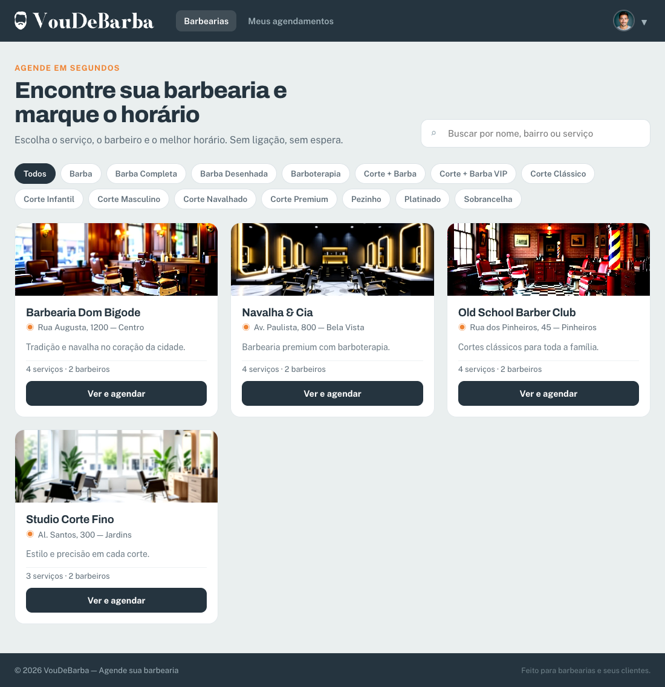
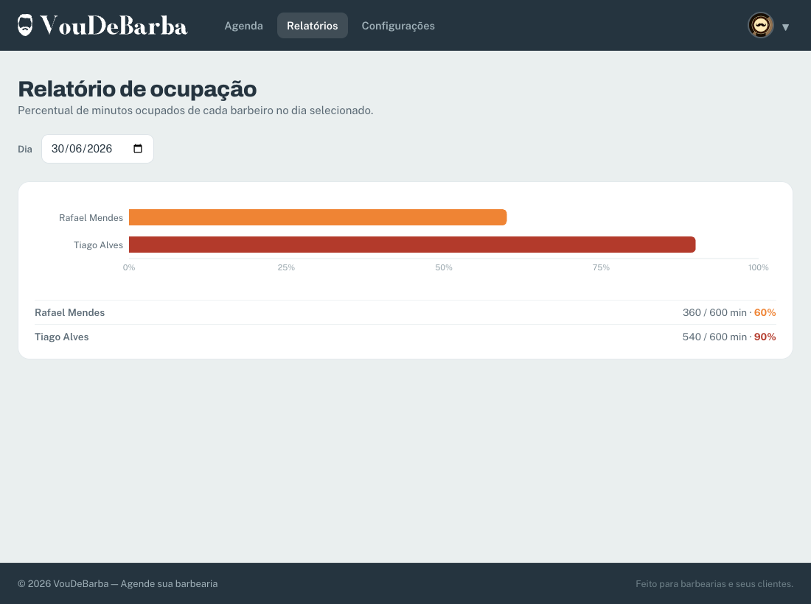
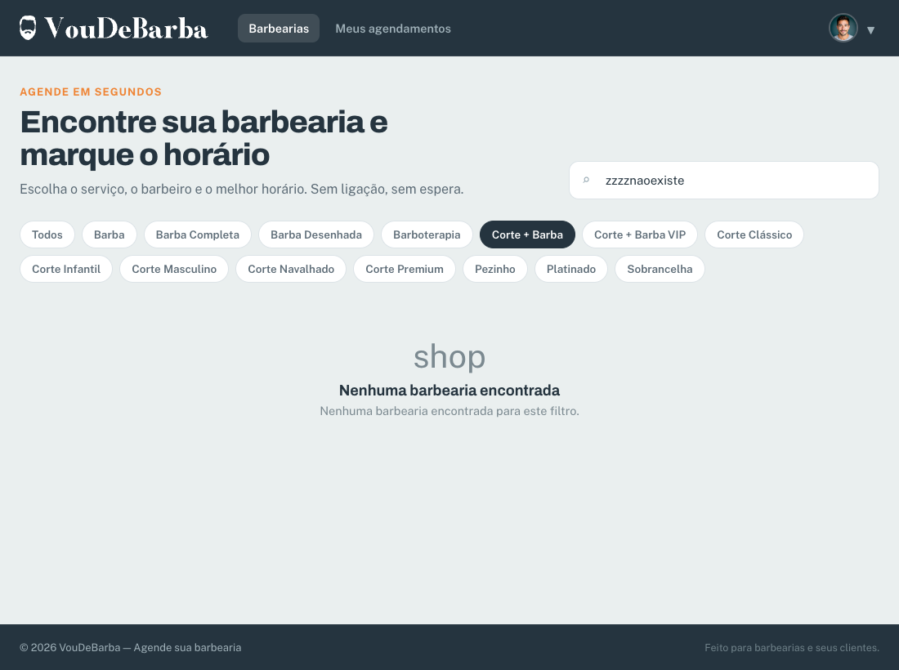
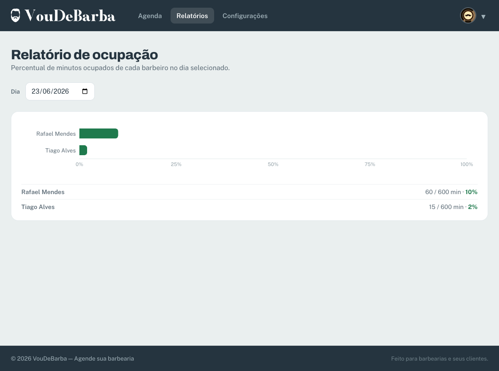

# Tutorial: Filtro de barbearias por serviço + Relatório de ocupação do barbeiro

Este é um tutorial **passo a passo, sem pular nada**. Se você seguir todas as instruções na ordem, ao final terá duas funcionalidades novas funcionando de ponta a ponta (backend FastAPI + frontend React) no projeto **VouDeBarba**.

Leia com calma. Cada passo diz **qual arquivo** mexer, se é **arquivo novo** ou **edição**, mostra o **código** e explica os pontos importantes.

---

# Setup — preparando o computador do zero

Antes de programar qualquer coisa, você precisa preparar o ambiente. Esta seção parte do zero: instala as ferramentas, baixa o projeto, liga o backend e o frontend e te deixa pronto para começar. Faça **na ordem** e não pule etapas.

## 1. Instalar as ferramentas

Você vai precisar de quatro programas. Instale cada um, depois confira se ficou tudo certo.

### Git

O **Git** é o programa que baixa o código do projeto da internet e guarda o histórico das suas mudanças. É como um "controle de versão": ele anota cada alteração que você faz, então dá para voltar atrás se algo quebrar.

- **Windows:** baixe em https://git-scm.com/download/win e instale com as opções padrão.
- **macOS:** abra o Terminal e rode `xcode-select --install` (ou instale pelo https://git-scm.com/download/mac).
- **Linux:** `sudo apt install git` (Ubuntu/Debian) ou o gerenciador da sua distro.

### Python 3.11 ou mais novo

O **Python** é a linguagem do backend (a parte que roda no servidor e fala com o banco de dados). Baixe em https://www.python.org/downloads/ e instale a versão **3.11 ou superior**.

> **Atenção importante:** o projeto tem um arquivo chamado `.python-version` que aponta para o Python **3.14**. Essa versão pode não existir no seu computador e vai te dar erro. Não se preocupe: mais abaixo você vai criar o ambiente do projeto (a "venv") **forçando** o Python 3.11, e tudo funciona. Ignore o que está no `.python-version`.

> **No Windows:** ao instalar o Python, marque a caixinha **"Add Python to PATH"** na primeira tela do instalador. Sem isso, o comando `python` não funciona no terminal.

### Bun

O **Bun** é a ferramenta que cuida da parte do frontend (a tela que aparece no navegador). Ele instala as bibliotecas que o site usa e roda o servidor de desenvolvimento. Pense nele como um "ajudante" do JavaScript, mais rápido que o tradicional `npm`.

> **Importante:** neste projeto o gerenciador oficial é o **Bun**, *não* o `npm`. Use sempre os comandos com `bun`. Se você ver algum tutorial antigo mandando usar `npm`, troque por `bun`.

- **macOS / Linux:** `curl -fsSL https://bun.sh/install | bash`
- **Windows:** `powershell -c "irm bun.sh/install.ps1 | iex"`

### VSCode

O **VSCode** (Visual Studio Code) é o editor de código onde você vai escrever tudo. Baixe em https://code.visualstudio.com/ e instale.

### Conferir se deu certo

Abra um terminal novo e rode os três comandos abaixo. Cada um deve mostrar um número de versão (não um erro de "comando não encontrado"):

```bash
git --version
python --version
bun --version
```

Se `python --version` mostrar algo abaixo de 3.11, ou der erro, tente `python3 --version`. Em alguns sistemas o comando é `python3` em vez de `python`.

## 2. Baixar (clonar) o projeto

"Clonar" é baixar uma cópia completa do projeto, com todo o histórico. Escolha uma pasta onde quer guardar seus projetos, abra o terminal nela e rode:

```bash
git clone https://github.com/cost4c/voudebarba.git
cd voudebarba
```

Agora você está dentro da pasta do projeto. Abra essa pasta no VSCode (menu **File → Open Folder**, ou rode `code .` no terminal).

## 3. Criar uma branch para o seu trabalho

Uma **branch** é uma "linha de trabalho paralela". Você cria uma branch separada para fazer suas mudanças sem mexer na versão principal do projeto (chamada `main`). **Por que fazer isso?** Porque assim, se algo der errado, a versão principal continua intacta — você só joga fora a sua branch. É a forma segura de experimentar.

Crie e entre na sua branch:

```bash
git checkout -b minha-feature
```

O `-b` cria a branch e já te coloca dentro dela. A partir daqui, tudo que você fizer fica isolado em `minha-feature`.

## 4. Preparar o backend

O backend usa Python. A boa prática é criar um **ambiente virtual** (a "venv"): uma pasta isolada onde ficam só as bibliotecas deste projeto, sem bagunçar o Python do resto do computador.

Entre na pasta do backend e crie a venv **usando o Python 3.11** (lembra do aviso sobre o `.python-version`?):

```bash
cd backend
python -m venv .venv
```

> Se o comando `python` apontar para uma versão diferente de 3.11+, use o caminho completo do 3.11. Por exemplo, no macOS/Linux: `python3.11 -m venv .venv`. No Windows, pode ser `py -3.11 -m venv .venv`.

Agora **ative** a venv (isso liga o ambiente isolado no seu terminal):

- **macOS / Linux:** `source .venv/bin/activate`
- **Windows (PowerShell):** `.venv\Scripts\Activate.ps1`
- **Windows (CMD):** `.venv\Scripts\activate.bat`

Quando a venv está ativa, aparece um `(.venv)` no começo da linha do terminal. Com ela ativa, instale as bibliotecas que o backend precisa:

```bash
pip install -r requirements.txt
```

O arquivo `requirements.txt` é uma lista de tudo que o backend usa (FastAPI e companhia). O `pip install -r` baixa tudo de uma vez.

## 5. Preparar o frontend

O frontend usa JavaScript/React. Abra **outro terminal**, vá para a pasta do frontend e instale as bibliotecas com o Bun:

```bash
cd frontend
bun install
```

Isso baixa todas as dependências do site (React, Recharts, etc.) listadas no `package.json`.

## 6. Rodar tudo

Você vai manter **dois terminais abertos** ao mesmo tempo: um para o backend, outro para o frontend.

**Terminal do backend** (com a venv ativa, dentro de `backend`):

```bash
.venv/bin/python main.py
```

O backend sobe na porta **8415**. A documentação interativa (onde dá para testar as rotas) fica em `http://localhost:8415/docs`.

**Terminal do frontend** (dentro de `frontend`):

```bash
bun run dev
```

O site sobe na porta **5185**. Abra `http://localhost:5185` no navegador.

> **Dica:** deixe os dois terminais rodando o tempo todo enquanto programa. O backend se atualiza sozinho quando você salva um arquivo `.py`; o frontend se atualiza sozinho quando você salva um `.tsx`/`.ts`.

## 7. Extensões recomendadas do VSCode

Extensões são "complementos" que deixam o VSCode mais inteligente para cada linguagem. Abra o painel de extensões (ícone de blocos na barra lateral, ou `Ctrl+Shift+X`) e instale estas:

- **Python** — suporte básico para rodar e depurar código Python.
- **Pylance** — autocompletar e detecção de erros de Python em tempo real.
- **Python Debugger** — permite pausar o código e investigar passo a passo.
- **Python Environments** — ajuda a escolher e gerenciar a venv certa.
- **ESLint** — aponta erros e problemas de estilo no código JavaScript/TypeScript.
- **SQLite3 Editor** — abre e visualiza o banco de dados SQLite direto no editor.
- **vscode-icons** — coloca ícones bonitos nos arquivos, facilita achar as coisas.
- **HTML CSS Support** — autocompletar para HTML e CSS.

Pronto! Com o ambiente preparado e os dois servidores rodando, você já pode seguir o tutorial.

---

## O que você vai construir

Você vai implementar **duas funcionalidades** no VouDeBarba:

1. **(A) Filtro de barbearias por serviço.** Na página inicial (a HomePage), o cliente vai poder escolher um serviço (ex.: "Corte degradê", "Barba") clicando em um dos botões em formato de pílula — chamamos esses botões de **chips**. Ao escolher um serviço, a lista de barbearias passa a mostrar **só as barbearias que oferecem aquele serviço**. Isso é feito acrescentando um novo parâmetro de busca `?servico_id` no **endpoint** público `GET /api/barbearias`. (Um **endpoint** é simplesmente um "endereço" do backend que o frontend chama para pedir ou enviar dados — como uma porta de atendimento.) Esse endpoint faz um `JOIN` com a tabela `servico`. (Um **JOIN** é um comando do banco de dados que **junta** informações de duas tabelas — aqui, ele cruza "barbearias" com "serviços" para descobrir quais barbearias têm aquele serviço.)

2. **(B) Relatório de ocupação do barbeiro.** O dono da barbearia (perfil `Barbearia`) vai ganhar uma página nova de relatório. Para um dia escolhido, o sistema calcula, **para cada barbeiro**, quantos minutos ele ficou ocupado (somando a duração dos agendamentos `Agendado`/`Realizado` daquele dia) e divide pelos minutos disponíveis (o expediente da barbearia naquele dia). O resultado é um **percentual de ocupação**, mostrado em uma **barra de progresso** por barbeiro (usando a biblioteca Recharts, que o projeto já usa no painel de administração).

**Resultado final esperado:**

- `GET /api/barbearias?servico_id=3` devolve só as barbearias que têm o serviço `3` ativo.
- Na HomePage, aparecem chips de serviços; clicar em um chip filtra a lista de barbearias.
- `GET /api/barbearia/estatisticas/ocupacao?data=2026-06-22` devolve uma lista de barbeiros com percentual de ocupação.
- Uma nova página `/relatorios` (menu "Relatórios" no perfil Barbearia) mostra uma barra de progresso por barbeiro.

Para você ter uma ideia clara de onde quer chegar, é assim que as duas telas vão ficar no fim:





---

## Pré-requisitos

Você já preparou tudo na seção **Setup** lá em cima. Confira só que os **dois servidores estão rodando**, cada um em seu terminal. Se ainda não estiverem, suba os dois.

### Terminal 1 — Backend

Como o `.python-version` aponta para uma versão de Python que talvez não exista no seu computador, **sempre** rode o backend pelo Python que está dentro da venv (e não pelo Python "global"):

```bash
cd backend
.venv/bin/python main.py
```

O backend sobe (em desenvolvimento, na porta **8415**). A documentação interativa, onde dá para testar as rotas direto no navegador, fica em `http://localhost:8415/docs`.

### Terminal 2 — Frontend

```bash
cd frontend
bun run dev
```

O Vite (o servidor que monta o site) sobe na porta **5185** e encaminha tudo que começa com `/api` para o backend. Acesse `http://localhost:5185`.

### Logins úteis para testar (senha demo `1234aA@#`)

- Dono de barbearia: `dom@voudebarba.com` (perfil `Barbearia`) — use para a funcionalidade B.
- Cliente: `cliente@voudebarba.com` — use para ver a HomePage filtrando por serviço (a HomePage também é pública, então dá para testar sem login).

> **Dica:** Mantenha os dois terminais rodando o tempo todo. O backend recarrega sozinho ao salvar `.py`; o Vite recarrega sozinho ao salvar `.tsx/.ts`.

---

## As camadas e a ordem de implementação

O VouDeBarba é organizado em **camadas** — pense em andares de um prédio, cada um com uma função. Uma "requisição" (um pedido que o navegador faz ao servidor) passa por esses andares na ordem. No backend, o caminho é:

```
Rota (routes/) → DTO de saída (dtos/responses/) → Repositório (repo/) → SQL (sql/) → Banco SQLite
```

No frontend:

```
Página (pages/) → tipos (lib/types.ts) → cliente HTTP (lib/api.ts) → backend
```

Repare na sigla **DTO** (de "Data Transfer Object", ou "objeto de transporte de dados"). É só o "molde" que define **quais campos** o backend manda de volta para o frontend — uma espécie de formulário com os campos certos. O "DTO de saída" é o molde da resposta.

Vamos implementar **de baixo para cima** (do banco de dados até a tela). Por quê? Porque cada camada **depende** da camada de baixo. Se você começar pela tela, vai acabar chamando um endpoint que ainda não existe e nada funciona. Construindo de baixo para cima, dá para testar cada passo sozinho (pelo `/docs`) antes de subir para o próximo.

### Ordem para a Funcionalidade A (Filtro por serviço)

1. **SQL** — nova query `OBTER_TODOS_POR_SERVICO` em `sql/barbearia_sql.py`.
2. **Repo** — nova função `obter_todos_por_servico(...)` em `repo/barbearia_repo.py`.
3. **Rota** — adicionar o parâmetro `servico_id` na rota `GET /barbearias` em `routes/barbearias_routes.py`. (Não precisa de DTO de saída novo: **reusamos** o `BarbeariaResumoResponse` que já existe.)
4. **Frontend** — adicionar chips de serviço na `HomePage.tsx` e passar o `servico_id` no `params`.

### Ordem para a Funcionalidade B (Relatório de ocupação)

1. **Repo** — nova função `obter_ocupacao_por_barbeiro(...)` (sem SQL novo isolado; usa repos já existentes). Vamos criar um pequeno repo de relatório no módulo da barbearia.
2. **DTO de saída** — novo `OcupacaoResponse` em `dtos/responses/ocupacao_response.py`.
3. **Rota** — novo endpoint `GET /barbearia/estatisticas/ocupacao?data=` em `routes/barbearia_admin_routes.py`.
4. **Frontend** — tipo `Ocupacao` em `types.ts`, página nova `RelatoriosPage.tsx`, registro no `router.tsx` e item de menu no `AppLayout.tsx`.

> **Nenhuma tabela nova é criada.** A funcionalidade A só **lê** tabelas que já existem (`barbearia` + `servico`). A funcionalidade B também só lê (`barbeiro`, `agendamento` e os horários da `barbearia`). Mesmo assim, lá no fim tem uma seção mostrando **como** se registraria uma tabela nova — porque esse é o passo que mais derruba aluno quando a funcionalidade exige uma tabela. Vale guardar para a próxima vez.

---

# PARTE A — Filtro de barbearias por serviço

> **Não confunda os dois routers:** a Funcionalidade A mexe em `routes/barbearias_routes.py` (prefixo `/barbearias`, **plural** — rotas **públicas** de listagem/detalhe). Já a Funcionalidade B (Parte B) mexe em `routes/barbearia_admin_routes.py` (prefixo `/barbearia`, **singular** — área do perfil **Barbearia**, escopada ao dono). São arquivos e prefixos diferentes; preste atenção no singular/plural ao abrir cada um.

## Passo A1 — SQL: nova query com JOIN

**Arquivo:** `backend/sql/barbearia_sql.py`
**Tipo:** EDIÇÃO

Abra o arquivo. Você vai ver no início a constante `OBTER_TODOS` (a query da listagem pública atual). Logo **abaixo** dela, adicione uma nova constante `OBTER_TODOS_POR_SERVICO`.

Localize este trecho (já existe no arquivo):

```python
OBTER_TODOS = """
SELECT b.*,
       (SELECT COUNT(*) FROM servico s WHERE s.barbearia_id = b.id AND s.ativo = 1) AS total_servicos,
       (SELECT COUNT(*) FROM barbeiro br WHERE br.barbearia_id = b.id AND br.ativo = 1) AS total_barbeiros
FROM barbearia b
WHERE b.ativa = 1
  AND (
        ? = ''
        OR LOWER(b.nome) LIKE '%' || LOWER(?) || '%'
        OR LOWER(b.endereco_texto) LIKE '%' || LOWER(?) || '%'
      )
ORDER BY b.nome COLLATE NOCASE ASC
"""
```

Logo **depois** desse bloco, cole esta nova constante:

```python
# Filtra por NOME do serviço (o chip envia um id representativo MIN(id) por
# nome via OBTER_SERVICOS_DISTINTOS). Casar por sv.id exato deixaria de fora
# barbearias que oferecem um serviço de MESMO nome porém com outro id. Por isso
# resolvemos o nome do serviço a partir do id recebido e casamos todas as
# barbearias que tenham um serviço ativo com aquele nome (case-insensitive).
OBTER_TODOS_POR_SERVICO = """
SELECT b.*,
       (SELECT COUNT(*) FROM servico s WHERE s.barbearia_id = b.id AND s.ativo = 1) AS total_servicos,
       (SELECT COUNT(*) FROM barbeiro br WHERE br.barbearia_id = b.id AND br.ativo = 1) AS total_barbeiros
FROM barbearia b
WHERE b.ativa = 1
  AND EXISTS (
        SELECT 1
        FROM servico sv
        WHERE sv.barbearia_id = b.id
          AND sv.ativo = 1
          AND LOWER(sv.nome) = (
                SELECT LOWER(nome) FROM servico WHERE id = ?
              )
      )
  AND (
        ? = ''
        OR LOWER(b.nome) LIKE '%' || LOWER(?) || '%'
        OR LOWER(b.endereco_texto) LIKE '%' || LOWER(?) || '%'
      )
ORDER BY b.nome COLLATE NOCASE ASC
"""
```

**Explicação linha a linha do que é novo:**

- A diferença para `OBTER_TODOS` é a condição `AND EXISTS (...)`, que mantém apenas as barbearias que oferecem o serviço escolhido.
- **Por que casar por NOME e não por `sv.id` exato?** Os chips da HomePage são montados pela query `OBTER_SERVICOS_DISTINTOS`, que agrupa serviços por nome (`GROUP BY LOWER(nome)`) e envia apenas **um id representativo** (`MIN(id)`) por nome. Como o mesmo serviço (ex.: "Corte + Barba") existe em várias barbearias com **ids diferentes**, filtrar por `sv.id = ?` retornaria só a barbearia dona daquele id específico — escondendo as demais. Casando pelo **nome** do serviço, todas as barbearias que oferecem aquele serviço aparecem corretamente.
- `SELECT LOWER(nome) FROM servico WHERE id = ?` — resolve o nome do serviço a partir do id representativo enviado pelo chip. O primeiro `?` é o `servico_id`.
- `EXISTS (SELECT 1 FROM servico sv WHERE sv.barbearia_id = b.id AND sv.ativo = 1 AND LOWER(sv.nome) = ...)` — só mantém barbearias que têm um serviço ativo com aquele nome. `LOWER(...)` deixa a comparação insensível a maiúsculas/minúsculas.
- Os outros três `?` continuam sendo o termo de busca `q` (repetido 3 vezes, igual à query original).
- **A ordem dos parâmetros importa:** `(servico_id, termo, termo, termo)`. O `servico_id` vem **primeiro** porque o `?` dele aparece antes no SQL (lá dentro do `EXISTS`). Os `?` são preenchidos na mesma ordem em que aparecem.
- Sempre usamos `?` (chamado "prepared statement" — o banco substitui os `?` pelos valores de forma segura), **nunca** montamos a query colando texto com f-string. Por quê? Porque colar texto direto abre a porta para o "SQL injection": um usuário mal-intencionado poderia digitar um pedaço de comando SQL no campo de busca e bagunçar o banco. Com `?`, isso não acontece.

## Passo A2 — Repo: nova função que usa a query

**Arquivo:** `backend/repo/barbearia_repo.py`
**Tipo:** EDIÇÃO

Primeiro, ajuste o **import** das queries no topo do arquivo. Localize:

```python
from sql.barbearia_sql import (
    CRIAR_TABELA,
    INSERIR,
    ATUALIZAR,
    OBTER_TODOS,
    OBTER_TODOS_ADMIN,
    OBTER_POR_ID,
    OBTER_POR_DONO,
    ATUALIZAR_STATUS,
    EXCLUIR,
)
```

Adicione `OBTER_TODOS_POR_SERVICO` na lista (pode ser logo após `OBTER_TODOS`):

```python
from sql.barbearia_sql import (
    CRIAR_TABELA,
    INSERIR,
    ATUALIZAR,
    OBTER_TODOS,
    OBTER_TODOS_POR_SERVICO,
    OBTER_TODOS_ADMIN,
    OBTER_POR_ID,
    OBTER_POR_DONO,
    ATUALIZAR_STATUS,
    EXCLUIR,
)
```

Agora, localize a função `obter_todos` existente:

```python
def obter_todos(q: str = "") -> list[Barbearia]:
    """Lista barbearias ativas, filtrando por nome/endereço quando ``q`` informado."""
    termo = (q or "").strip()
    with obter_conexao() as conn:
        cursor = conn.cursor()
        cursor.execute(OBTER_TODOS, (termo, termo, termo))
        rows = cursor.fetchall()
        return [_row_to_barbearia(row) for row in rows]
```

**Logo abaixo** dela, adicione a nova função:

```python
def obter_todos_por_servico(servico_id: int, q: str = "") -> list[Barbearia]:
    """Lista barbearias ativas que oferecem o serviço informado (ativo).

    Mesmo filtro de nome/endereço de ``obter_todos``. O ``servico_id`` é o id
    representativo enviado pelo chip; a query resolve o NOME desse serviço e
    retorna todas as barbearias que oferecem um serviço ativo com aquele nome.
    """
    termo = (q or "").strip()
    with obter_conexao() as conn:
        cursor = conn.cursor()
        cursor.execute(OBTER_TODOS_POR_SERVICO, (servico_id, termo, termo, termo))
        rows = cursor.fetchall()
        return [_row_to_barbearia(row) for row in rows]
```

**Explicação:**

- A assinatura segue o padrão do projeto: parâmetros simples, retorno `list[Barbearia]`.
- `with obter_conexao() as conn:` — abre a conexão com o banco. Esse "ajudante" (helper) já liga a verificação de chaves estrangeiras (`PRAGMA foreign_keys = ON`), configura o acesso às colunas por nome (`row_factory = sqlite3.Row`) e salva as mudanças automaticamente ao terminar o bloco `with`. Por isso você **não** precisa chamar `commit()` na mão.
- `cursor.execute(OBTER_TODOS_POR_SERVICO, (servico_id, termo, termo, termo))` — passa os 4 parâmetros como **tupla**, na ordem exata dos `?` do SQL.
- `[_row_to_barbearia(row) for row in rows]` — converte cada linha (`sqlite3.Row`) na entidade de domínio `Barbearia` usando o helper que já existe no arquivo. Reaproveitamos `_row_to_barbearia`, então `total_servicos` e `total_barbeiros` continuam preenchidos.

## Passo A3 — Rota: aceitar o parâmetro `servico_id`

**Arquivo:** `backend/routes/barbearias_routes.py`
**Tipo:** EDIÇÃO

Localize a rota de listagem pública:

```python
@router.get("", response_model=list[BarbeariaResumoResponse])
async def listar(
    request: Request,
    q: Optional[str] = None,
):
    """Lista barbearias ativas, filtrando por nome/endereço quando ``q`` informado."""
    checar_rate_limit(barbearias_listar_limiter, request)

    barbearias = barbearia_repo.obter_todos(q or "")
    return [BarbeariaResumoResponse.de_barbearia(b) for b in barbearias]
```

Substitua **toda** essa função por esta versão:

```python
@router.get("", response_model=list[BarbeariaResumoResponse])
async def listar(
    request: Request,
    q: Optional[str] = None,
    servico_id: Optional[int] = None,
):
    """Lista barbearias ativas.

    Filtra por nome/endereço quando ``q`` é informado e, quando ``servico_id``
    é informado, restringe às barbearias que oferecem aquele serviço (ativo).
    """
    checar_rate_limit(barbearias_listar_limiter, request)

    if servico_id is not None:
        barbearias = barbearia_repo.obter_todos_por_servico(servico_id, q or "")
    else:
        barbearias = barbearia_repo.obter_todos(q or "")

    return [BarbeariaResumoResponse.de_barbearia(b) for b in barbearias]
```

**Explicação:**

- `servico_id: Optional[int] = None` — declara o novo **query param**. Como tem valor padrão `None`, é **opcional**: `GET /api/barbearias` (sem nada) continua funcionando igual. FastAPI lê automaticamente `?servico_id=3` da URL e converte para `int`.
- `if servico_id is not None:` — se o cliente passou um serviço, usamos a função nova com JOIN; senão, mantemos o comportamento antigo.
- **Reusamos** o `BarbeariaResumoResponse` que já existe — nenhum DTO novo é criado. É exatamente o que o escopo pediu (reusar a response de lista).
- `checar_rate_limit(...)` continua na primeira linha útil, como em todas as rotas do projeto.

> **Atenção:** o `prefix` do router é `/barbearias` (definido lá no topo: `router = APIRouter(prefix="/barbearias")`) e todos os routers são montados sob `/api`. Por isso a URL final é `GET /api/barbearias`. Esta rota **já está registrada** no `main.py` (é a listagem pública que já existia), então **você não precisa registrar nada novo** para a Funcionalidade A no backend.

### Teste rápido da Funcionalidade A no backend

Abra `http://localhost:8415/docs`, procure o endpoint `GET /api/barbearias`, clique em "Try it out", preencha `servico_id` com um id de serviço existente (ex.: `1`) e execute. A resposta deve trazer só as barbearias que têm aquele serviço. Sem `servico_id`, traz todas.

## Passo A4 — Frontend: chips de serviço na HomePage

**Arquivo:** `frontend/src/pages/HomePage.tsx`
**Tipo:** EDIÇÃO

Para montar os chips, a HomePage precisa de uma lista de **serviços distintos**. A ideia é simples: cada chip representa um serviço e, ao ser clicado, dispara `GET /barbearias?servico_id=...` (a rota que você ajustou no passo A3). A lista de chips vem de um endpoint público de serviços distintos — `GET /barbearias/servicos` — que **ainda não existe** e será criado no **passo A5**.

Por isso, o código abaixo já chama `GET /barbearias/servicos`, mas envolto num `catch` silencioso: enquanto o endpoint do A5 não existir, a chamada falha sem quebrar a tela — apenas os chips não aparecem, e a busca por nome continua funcionando normalmente.

Substitua **todo** o conteúdo do arquivo `HomePage.tsx` por esta versão (ela mantém tudo que já existia e adiciona os chips):

```tsx
// Listagem/busca de barbearias (rota "/").
// Agora com filtro por serviço: chips de serviço chamam GET /barbearias?servico_id=.
import { useEffect, useState } from 'react'
import { api, ApiError } from '../lib/api'
import type { BarbeariaResumo, Servico } from '../lib/types'
import ShopCard from '../components/vdb/ShopCard'
import EmptyState from '../components/ui/EmptyState'
import Spinner from '../components/ui/Spinner'
import { toast } from '../store/uiStore'

export default function HomePage() {
  const [query, setQuery] = useState('')
  const [shops, setShops] = useState<BarbeariaResumo[]>([])
  const [carregando, setCarregando] = useState(true)

  // Lista de serviços para os chips + qual está selecionado (null = todos).
  const [servicos, setServicos] = useState<Servico[]>([])
  const [servicoId, setServicoId] = useState<number | null>(null)

  // Carrega os serviços disponíveis uma única vez (para montar os chips).
  useEffect(() => {
    let vivo = true
    api
      .get<Servico[]>('/barbearias/servicos')
      .then((d) => vivo && setServicos(d))
      .catch(() => {
        /* silencioso: sem chips, a busca por nome continua funcionando */
      })
    return () => {
      vivo = false
    }
  }, [])

  // Debounce da busca: refaz GET /barbearias a cada mudança de texto OU de serviço.
  useEffect(() => {
    const controller = new AbortController()
    const q = query.trim()
    const timer = setTimeout(() => {
      setCarregando(true)
      api
        .get<BarbeariaResumo[]>('/barbearias', {
          params: {
            q: q || undefined,
            servico_id: servicoId ?? undefined,
          },
          signal: controller.signal,
        })
        .then((data) => {
          setShops(data)
          setCarregando(false)
        })
        .catch((e) => {
          if ((e as Error).name === 'AbortError') return
          setCarregando(false)
          toast.erro(e instanceof ApiError ? e.message : 'Não foi possível carregar as barbearias.')
        })
    }, 300)
    return () => {
      controller.abort()
      clearTimeout(timer)
    }
  }, [query, servicoId])

  return (
    <section>
      <div
        style={{
          display: 'flex',
          flexWrap: 'wrap',
          alignItems: 'flex-end',
          justifyContent: 'space-between',
          gap: 20,
          marginBottom: 26,
        }}
      >
        <div style={{ maxWidth: 560 }}>
          <div
            style={{
              fontSize: 13,
              fontWeight: 700,
              letterSpacing: '.08em',
              textTransform: 'uppercase',
              color: 'var(--accent-d)',
              marginBottom: 10,
            }}
          >
            Agende em segundos
          </div>
          <h1
            style={{
              fontFamily: "'Archivo', sans-serif",
              fontWeight: 800,
              fontSize: 38,
              lineHeight: 1.05,
              letterSpacing: '-.025em',
              margin: '0 0 10px',
            }}
          >
            Encontre sua barbearia e marque o horário
          </h1>
          <p style={{ margin: 0, fontSize: 16, color: '#5C6B76', lineHeight: 1.5 }}>
            Escolha o serviço, o barbeiro e o melhor horário. Sem ligação, sem espera.
          </p>
        </div>
        <div style={{ position: 'relative', flex: 1, minWidth: 280, maxWidth: 380 }}>
          <input
            value={query}
            onChange={(e) => setQuery(e.target.value)}
            placeholder="Buscar por nome, bairro ou serviço"
            style={{
              width: '100%',
              background: '#fff',
              border: '1px solid #DCE3E7',
              borderRadius: 12,
              padding: '14px 16px 14px 44px',
              fontSize: 15,
              color: '#25343F',
            }}
          />
          <span
            style={{
              position: 'absolute',
              left: 16,
              top: '50%',
              transform: 'translateY(-50%)',
              color: '#9FB0B8',
              fontSize: 17,
            }}
          >
            ⌕
          </span>
        </div>
      </div>

      {/* Chips de serviço — filtram a lista por servico_id. */}
      {servicos.length > 0 && (
        <div style={{ display: 'flex', flexWrap: 'wrap', gap: 8, marginBottom: 22 }}>
          <Chip ativo={servicoId === null} onClick={() => setServicoId(null)}>
            Todos
          </Chip>
          {servicos.map((sv) => (
            <Chip
              key={sv.id}
              ativo={servicoId === sv.id}
              onClick={() => setServicoId(sv.id)}
            >
              {sv.nome}
            </Chip>
          ))}
        </div>
      )}

      {carregando ? (
        <Spinner texto="Carregando barbearias..." />
      ) : shops.length === 0 ? (
        <EmptyState
          icon="shop"
          titulo="Nenhuma barbearia encontrada"
          mensagem={
            query.trim() || servicoId !== null
              ? 'Nenhuma barbearia encontrada para este filtro.'
              : 'Ainda não há barbearias disponíveis.'
          }
        />
      ) : (
        <div
          className="vdb-shops-grid"
          style={{ display: 'grid', gridTemplateColumns: 'repeat(3, 1fr)', gap: 20 }}
        >
          {shops.map((sh) => (
            <ShopCard key={sh.id} shop={sh} />
          ))}
        </div>
      )}
    </section>
  )
}

// Chip de filtro (pílula clicável). Estilo inline + tokens, sem Bootstrap.
function Chip({
  children,
  ativo,
  onClick,
}: {
  children: React.ReactNode
  ativo: boolean
  onClick: () => void
}) {
  return (
    <button
      onClick={onClick}
      style={{
        border: '1px solid',
        borderColor: ativo ? '#25343F' : '#DCE3E7',
        background: ativo ? '#25343F' : '#fff',
        color: ativo ? '#fff' : '#5C6B76',
        fontWeight: 600,
        fontSize: 13.5,
        padding: '8px 14px',
        borderRadius: 999,
        cursor: 'pointer',
      }}
    >
      {children}
    </button>
  )
}
```

**Explicação dos pontos importantes:**

- `import type { BarbeariaResumo, Servico } from '../lib/types'` — importamos também o tipo `Servico`, que já existe em `types.ts`.
- `const [servicoId, setServicoId] = useState<number | null>(null)` — guarda qual serviço está selecionado. `null` = "Todos".
- O **primeiro** `useEffect` carrega a lista de serviços (para os chips) com `api.get<Servico[]>('/barbearias/servicos')`. Se falhar, fica silencioso — a busca por nome continua funcionando.
- O **segundo** `useEffect` depende de `[query, servicoId]`: sempre que o texto **ou** o serviço selecionado mudam, ele refaz a busca. O `setTimeout` de 300ms é um "debounce": em vez de chamar o backend a cada letra digitada, ele espera você parar de digitar por um instante. Isso evita disparar dezenas de chamadas seguidas enquanto você digita.
- `params: { q: q || undefined, servico_id: servicoId ?? undefined }` — o `api.ts` monta a query string automaticamente e **ignora** valores `undefined`. Então, quando `servicoId` é `null` (vira `undefined`), o param `servico_id` simplesmente **não** é enviado, e o backend lista todas as barbearias.
- Os caminhos no front são **relativos a `/api`**: escrevemos `/barbearias`, não `/api/barbearias`. O `api.ts` adiciona o prefixo.
- O `<Chip>` usa estilos inline com os tokens de cor do projeto (`#25343F` é o `ink`). **Não** usamos Bootstrap nem CSS externo, seguindo a convenção do VouDeBarba.

> **Importante (endpoint dos chips):** o código acima chama `GET /barbearias/servicos`. Esse endpoint **ainda não existe**. Para os chips funcionarem, faça o passo opcional A5 abaixo. Se você **não** quiser criar esse endpoint, os chips simplesmente não aparecem (o `catch` silencioso cuida disso) e o filtro por serviço ainda pode ser testado pelo `/docs`. Mas, para entregar a Funcionalidade A **completa na tela**, faça o A5.

## Passo A5 — Endpoint de serviços para os chips (necessário para a UI)

Os chips precisam de uma lista de serviços distintos. Vamos criar um endpoint público simples que devolve os nomes de serviços ativos (sem repetir). Isso é leitura pura, sem tabela nova.

### A5.1 — SQL

**Arquivo:** `backend/sql/servico_sql.py`
**Tipo:** EDIÇÃO

No final do arquivo, adicione:

```python
OBTER_SERVICOS_DISTINTOS = """
SELECT MIN(id) AS id, 0 AS barbearia_id, nome, '' AS descricao, 0 AS preco, 0 AS duracao_min, 1 AS ativo
FROM servico
WHERE ativo = 1
GROUP BY LOWER(nome)
ORDER BY nome COLLATE NOCASE ASC
"""
```

**Explicação:** agrupamos por `nome` (em minúsculo) para não repetir o mesmo serviço de barbearias diferentes. `MIN(id)` pega um id qualquer daquele nome (serve para usar como `servico_id` no filtro). As colunas `barbearia_id/descricao/preco/duracao_min/ativo` são preenchidas com valores neutros só para que o `_row_to_servico` consiga montar o objeto `Servico`. **Atenção:** o `_row_to_servico` lê `row["barbearia_id"]`, então o `SELECT` precisa expor essa coluna (`0 AS barbearia_id`) — sem ela o endpoint quebra com `IndexError: No item with that key`.

> **Observação didática:** o chip envia um `servico_id` **representativo** (`MIN(id)` daquele nome). Como o mesmo serviço (ex.: "Corte + Barba") existe em várias barbearias com **ids diferentes**, o filtro **não** casa por `sv.id` exato — se casasse, retornaria só a barbearia dona daquele id e esconderia as demais. Por isso a query `OBTER_TODOS_POR_SERVICO` (passo A2) resolve o **nome** do serviço a partir do id recebido e casa **todas** as barbearias que oferecem um serviço ativo com aquele nome. Assim, clicar em "Corte + Barba" mostra todas as barbearias que têm esse serviço.

### A5.2 — Repo

**Arquivo:** `backend/repo/servico_repo.py`
**Tipo:** EDIÇÃO

No import das queries, adicione `OBTER_SERVICOS_DISTINTOS`:

```python
from sql.servico_sql import (
    CRIAR_TABELA,
    INSERIR,
    ATUALIZAR,
    OBTER_POR_BARBEARIA,
    OBTER_POR_BARBEARIA_ATIVOS,
    OBTER_POR_ID,
    OBTER_SERVICOS_DISTINTOS,
    EXCLUIR,
)
```

No final do arquivo, adicione a função:

```python
def obter_servicos_distintos() -> list[Servico]:
    """Lista serviços ativos distintos por nome (para chips de filtro público)."""
    with obter_conexao() as conn:
        cursor = conn.cursor()
        cursor.execute(OBTER_SERVICOS_DISTINTOS)
        rows = cursor.fetchall()
        return [_row_to_servico(row) for row in rows]
```

### A5.3 — Rota

**Arquivo:** `backend/routes/barbearias_routes.py`
**Tipo:** EDIÇÃO

Adicione esta rota logo **após** a função `listar` (a que editamos no passo A3). Atenção à **ordem das rotas**: como `GET /barbearias/{id}` já existe, a rota fixa `/servicos` precisa ser declarada de forma que não seja confundida com `{id}`. No FastAPI, declarar `/servicos` **antes** de `/{id}` no arquivo resolve. Se preferir não reordenar, o FastAPI ainda casa `/servicos` corretamente porque `{id}` espera um `int` e "servicos" não é número — mas, por segurança e clareza, coloque a rota nova logo após `listar`:

```python
@router.get("/servicos", response_model=list[ServicoResponse])
async def listar_servicos(request: Request):
    """Lista serviços ativos distintos (para o filtro por serviço na home)."""
    checar_rate_limit(barbearias_listar_limiter, request)

    servicos = servico_repo.obter_servicos_distintos()
    return [ServicoResponse.de_servico(s) for s in servicos]
```

**Explicação:**

- `ServicoResponse` e `servico_repo` **já estão importados** no topo deste arquivo (confira: `from dtos.responses.servico_response import ServicoResponse` e `from repo import (... servico_repo)`). Você não precisa adicionar imports.
- Reusamos o `barbearias_listar_limiter` (rate limiter de leitura) que já existe no módulo.
- A URL final é `GET /api/barbearias/servicos`. Esse endpoint **já está coberto** pelo registro do `barbearias_router` no `main.py` — nada novo a registrar.

Pronto: a Funcionalidade A está completa, backend e frontend.

---

# PARTE B — Relatório de ocupação do barbeiro

Agora vamos para a funcionalidade do dono da barbearia.

## Entendendo o cálculo

Antes de programar, entenda **a conta** que o relatório faz. Para um **dia** escolhido e para **cada barbeiro** da barbearia:

- **Minutos disponíveis** = duração do expediente da barbearia naquele dia da semana. Ex.: das `09:00` às `18:00` = 9h = `540` minutos. Se a barbearia estiver fechada nesse dia, disponíveis = `0`.
- **Minutos ocupados** = soma da duração (`duracao_min` do serviço) de todos os agendamentos do barbeiro naquele dia cujo status seja `Agendado` **ou** `Realizado` (cancelados não contam).
- **Percentual** = `ocupados / disponiveis * 100`, arredondado. Se disponíveis for `0`, percentual = `0` (evita divisão por zero).

## Passo B1 — Repo de relatório

**Arquivo:** `backend/repo/relatorio_repo.py`
**Tipo:** ARQUIVO NOVO

Vamos criar um repo dedicado ao relatório. Ele **não cria tabela** — só lê dados combinando repos existentes (igual o `estatisticas_repo.py`, que também não tem tabela e não é registrado em `TABELAS`).

Crie o arquivo com este conteúdo completo:

```python
"""Repositório de relatórios da barbearia (sem tabela própria).

Calcula a ocupação de cada barbeiro num dia: minutos ocupados (soma da
duração dos agendamentos Agendado/Realizado) sobre os minutos disponíveis
(expediente da barbearia naquele dia da semana). Não é registrado em
TABELAS no main.py, pois não possui tabela.
"""

from datetime import datetime

from model.agendamento_model import StatusAgendamento
from repo import agendamento_repo, barbeiro_repo
from util.db_util import obter_conexao


# Statuses que contam como "ocupado".
_STATUS_OCUPADO = {
    StatusAgendamento.AGENDADO.value,
    StatusAgendamento.REALIZADO.value,
}


def _to_min(hhmm: str) -> int:
    """Converte "HH:MM" em minutos desde meia-noite."""
    partes = hhmm.split(":")
    return int(partes[0]) * 60 + int(partes[1])


def _dia_semana_da_data(data_iso: str) -> int:
    """Dia da semana (0=Domingo .. 6=Sábado) de uma data "YYYY-MM-DD"."""
    d = datetime.strptime(data_iso, "%Y-%m-%d")
    return (d.weekday() + 1) % 7


def _minutos_disponiveis(barbearia, data_iso: str) -> int:
    """Minutos de expediente da barbearia no dia da semana da data."""
    dia = _dia_semana_da_data(data_iso)
    horario = next(
        (h for h in barbearia.horarios if h.dia_semana == dia and h.ativo),
        None,
    )
    if not horario:
        return 0
    minutos = _to_min(horario.hora_fechamento) - _to_min(horario.hora_abertura)
    return max(minutos, 0)


def obter_ocupacao_por_barbeiro(barbearia, data_iso: str) -> list[dict]:
    """Para cada barbeiro da barbearia, calcula a ocupação no dia.

    Retorna uma lista de dicts com: barbeiro_id, barbeiro_nome,
    minutos_ocupados, minutos_disponiveis e percentual (0..100).
    """
    disponiveis = _minutos_disponiveis(barbearia, data_iso)
    barbeiros = barbeiro_repo.obter_por_barbearia(barbearia.id, somente_ativos=True)

    # Duração de cada serviço (para somar minutos por agendamento).
    duracoes = _duracoes_dos_servicos(barbearia.id)

    resultado: list[dict] = []
    for b in barbeiros:
        ativos = agendamento_repo.obter_ativos_do_barbeiro_no_dia(b.id, data_iso)
        ocupados = 0
        for ag in ativos:
            if ag.status.value in _STATUS_OCUPADO:
                ocupados += duracoes.get(ag.servico_id, 0)

        if disponiveis > 0:
            percentual = round(ocupados / disponiveis * 100)
        else:
            percentual = 0

        resultado.append(
            {
                "barbeiro_id": b.id,
                "barbeiro_nome": b.nome,
                "minutos_ocupados": ocupados,
                "minutos_disponiveis": disponiveis,
                "percentual": percentual,
            }
        )
    return resultado


def _duracoes_dos_servicos(barbearia_id: int) -> dict[int, int]:
    """Mapa servico_id -> duracao_min de todos os serviços da barbearia."""
    with obter_conexao() as conn:
        cursor = conn.cursor()
        cursor.execute(
            "SELECT id, duracao_min FROM servico WHERE barbearia_id = ?",
            (barbearia_id,),
        )
        return {row["id"]: row["duracao_min"] for row in cursor.fetchall()}
```

**Explicação dos pontos importantes:**

- O repo importa `agendamento_repo` e `barbeiro_repo` e reusa funções que já existem: `barbeiro_repo.obter_por_barbearia(...)` e `agendamento_repo.obter_ativos_do_barbeiro_no_dia(...)`. Essa última já filtra status `!= 'Cancelado'`, mas ainda assim conferimos `ag.status.value in _STATUS_OCUPADO` para deixar explícito que só `Agendado`/`Realizado` contam.
- `_STATUS_OCUPADO` usa o enum `StatusAgendamento` (`util`/model), **nunca** strings literais soltas — é a convenção do projeto.
- `_minutos_disponiveis` lê os `horarios` que já vêm carregados dentro da `barbearia` (o `barbearia_repo.obter_por_id`/`obter_por_dono` já carrega `barbearia.horarios`).
- `_duracoes_dos_servicos` faz uma consulta direta simples para montar um mapa `servico_id -> duracao_min`, evitando uma consulta por agendamento. Usa `with obter_conexao()` e `?` (prepared statement).
- O retorno é uma `list[dict]` — a rota vai converter cada dict em `OcupacaoResponse`. Esse padrão (repo devolve dict, rota monta o Response) é o mesmo do `estatisticas_repo`.

## Passo B2 — DTO de saída (Response)

**Arquivo:** `backend/dtos/responses/ocupacao_response.py`
**Tipo:** ARQUIVO NOVO

Crie o arquivo:

```python
"""Schema de resposta do relatório de ocupação de barbeiros."""

from pydantic import BaseModel, Field


class OcupacaoResponse(BaseModel):
    """Ocupação de um barbeiro num dia (espelha repo/relatorio_repo.py)."""

    barbeiro_id: int
    barbeiro_nome: str
    minutos_ocupados: int = Field(..., description="Soma da duração dos agendamentos ativos")
    minutos_disponiveis: int = Field(..., description="Minutos de expediente no dia")
    percentual: int = Field(..., description="Ocupação em % (0..100)")
```

**Explicação:**

- É um `BaseModel` do Pydantic, igual aos outros responses do projeto.
- Os nomes dos campos **batem exatamente** com as chaves do dict que o repo devolve. Isso permite construir o response com `OcupacaoResponse(**dict)`.
- Aqui não precisamos de um classmethod `de_...` porque o dado já vem como dict pronto (mesma estratégia do `EstatisticasResponse`).

## Passo B3 — Rota do relatório

**Arquivo:** `backend/routes/barbearia_admin_routes.py`
**Tipo:** EDIÇÃO

Este arquivo já tem todas as rotas do dono da barbearia. Vamos adicionar a rota do relatório.

### B3.1 — Imports

No topo do arquivo, na seção de **Schemas (saída)**, adicione o import do novo response. Localize o bloco:

```python
# Schemas (saída)
from dtos.responses.agendamento_response import AgendamentoResponse
from dtos.responses.barbearia_response import (
    BarbeariaDetalheResponse,
    HorarioResponse,
)
from dtos.responses.barbeiro_response import BarbeiroResponse
from dtos.responses.servico_response import ServicoResponse
```

Adicione a linha do `OcupacaoResponse`:

```python
# Schemas (saída)
from dtos.responses.agendamento_response import AgendamentoResponse
from dtos.responses.barbearia_response import (
    BarbeariaDetalheResponse,
    HorarioResponse,
)
from dtos.responses.barbeiro_response import BarbeiroResponse
from dtos.responses.ocupacao_response import OcupacaoResponse
from dtos.responses.servico_response import ServicoResponse
```

Ainda nos imports, localize o bloco dos repositórios:

```python
# Repositories
from repo import (
    agendamento_repo,
    barbearia_repo,
    barbeiro_repo,
    servico_repo,
)
```

Adicione o `relatorio_repo`:

```python
# Repositories
from repo import (
    agendamento_repo,
    barbearia_repo,
    barbeiro_repo,
    relatorio_repo,
    servico_repo,
)
```

### B3.2 — A rota

No **final** do arquivo (depois da seção de "Horários de funcionamento"), adicione:

```python
# =============================================================================
# Relatórios
# =============================================================================

@router.get("/estatisticas/ocupacao", response_model=list[OcupacaoResponse])
@requer_autenticacao([Perfil.BARBEARIA.value])
async def relatorio_ocupacao(
    request: Request,
    data: Optional[str] = None,
    usuario_logado: Optional[UsuarioLogado] = None,
):
    """Ocupação de cada barbeiro da barbearia num dia (% de minutos ocupados).

    Sem ``data``, usa o dia de hoje (timezone da aplicação).
    """
    assert usuario_logado is not None
    checar_rate_limit(barbearia_leitura_limiter, request)

    barbearia = _obter_barbearia_do_dono(usuario_logado)
    data_iso = data or hoje().strftime("%Y-%m-%d")

    # Valida o formato da data quando informada.
    try:
        datetime.strptime(data_iso, "%Y-%m-%d")
    except ValueError:
        raise HTTPException(
            status_code=status.HTTP_422_UNPROCESSABLE_ENTITY,
            detail="Data inválida. Use o formato YYYY-MM-DD.",
        )

    ocupacao = relatorio_repo.obter_ocupacao_por_barbeiro(barbearia, data_iso)
    return [OcupacaoResponse(**o) for o in ocupacao]
```

**Atenção:** essa rota usa `datetime.strptime`. Confira se `datetime` está importado no topo do arquivo. No `barbearia_admin_routes.py` original **não há** esse import. Adicione, no início da seção de imports (logo após o cabeçalho), junto às demais bibliotecas padrão:

```python
# Standard library
from datetime import datetime
from typing import Optional
```

(O arquivo já importava `from typing import Optional`; basta acrescentar a linha do `datetime` logo acima.)

**Explicação dos pontos importantes:**

- `@router.get("/estatisticas/ocupacao", ...)` — como o `prefix` do router é `/barbearia` e tudo fica sob `/api`, a URL final é `GET /api/barbearia/estatisticas/ocupacao`.
- `@requer_autenticacao([Perfil.BARBEARIA.value])` — só o perfil `Barbearia` acessa. Não logado → 401; perfil errado → 403. O decorator injeta `usuario_logado`; por isso o parâmetro é `Optional[UsuarioLogado] = None` e a função começa com `assert usuario_logado is not None`.
- `checar_rate_limit(barbearia_leitura_limiter, request)` — reusa o limiter de **leitura** que já existe no módulo (é uma consulta, não uma mutação).
- `_obter_barbearia_do_dono(usuario_logado)` — helper que já existe no arquivo; resolve a barbearia do dono logado (404 se não houver) e já traz `barbearia.horarios`.
- `data_iso = data or hoje().strftime("%Y-%m-%d")` — sem `data`, usa hoje. Usamos `hoje()` de `util/datetime_util` (já importado no arquivo), nunca `datetime.now()`.
- `[OcupacaoResponse(**o) for o in ocupacao]` — converte cada dict do repo no Response.

### Teste rápido da Funcionalidade B no backend

Abra `http://localhost:8415/docs`. **Atenção:** rotas com `@requer_autenticacao` exigem sessão (cookie). O jeito mais fácil de testar é logar pelo frontend como `dom@voudebarba.com` e depois acessar a URL no navegador: `http://localhost:5185/api/barbearia/estatisticas/ocupacao?data=2026-06-22`. Deve voltar um JSON com a lista de barbeiros e percentuais.

## Passo B4 — Frontend: tipo `Ocupacao`

**Arquivo:** `frontend/src/lib/types.ts`
**Tipo:** EDIÇÃO

No final do arquivo, adicione a interface que **espelha** o `OcupacaoResponse` do backend:

```typescript
// Espelha backend/dtos/responses/ocupacao_response.py (OcupacaoResponse)
export interface Ocupacao {
  barbeiro_id: number
  barbeiro_nome: string
  minutos_ocupados: number
  minutos_disponiveis: number
  percentual: number // 0..100
}
```

**Explicação:** os tipos do frontend precisam bater **exato** com os Response DTOs do backend (mesmos nomes de campo, mesmos tipos). Se um lado mudar, o outro precisa mudar junto.

## Passo B5 — Frontend: página de relatório

**Arquivo:** `frontend/src/pages/RelatoriosPage.tsx`
**Tipo:** ARQUIVO NOVO

Crie a página. Ela carrega a ocupação do dia (com um seletor de data) e desenha uma barra de progresso por barbeiro usando Recharts (um `BarChart` horizontal), igual ao estilo do painel admin.

```tsx
// RelatoriosPage — Relatório de ocupação dos barbeiros (perfil Barbearia).
// Consome GET /api/barbearia/estatisticas/ocupacao?data= e mostra uma barra
// de progresso por barbeiro (Recharts), igual ao estilo do painel admin.

import { useCallback, useEffect, useState, type CSSProperties } from 'react'
import {
  ResponsiveContainer,
  BarChart,
  Bar,
  XAxis,
  YAxis,
  Tooltip,
  Cell,
} from 'recharts'
import { api, ApiError } from '../lib/api'
import { toast } from '../store/uiStore'
import { colors, fonts } from '../lib/theme'
import { isoLocal } from '../lib/datas'
import type { Ocupacao } from '../lib/types'

// Cor da barra conforme o nível de ocupação.
function corPercentual(p: number): string {
  if (p >= 80) return '#B33A2B' // lotado (vermelho)
  if (p >= 50) return colors.accentD // movimentado (laranja escuro)
  return '#1F7A4D' // tranquilo (verde)
}

export default function RelatoriosPage() {
  // Data selecionada (default: hoje, no fuso local).
  const [data, setData] = useState(() => isoLocal(new Date()))
  const [ocupacao, setOcupacao] = useState<Ocupacao[]>([])
  const [carregando, setCarregando] = useState(true)

  const carregar = useCallback(async (dia: string) => {
    setCarregando(true)
    try {
      const d = await api.get<Ocupacao[]>('/barbearia/estatisticas/ocupacao', {
        params: { data: dia },
      })
      setOcupacao(d)
    } catch (e) {
      toast.erro(e instanceof ApiError ? e.message : 'Falha ao carregar o relatório.')
    } finally {
      setCarregando(false)
    }
  }, [])

  useEffect(() => {
    carregar(data)
  }, [carregar, data])

  return (
    <section>
      <h1 style={tituloStyle}>Relatório de ocupação</h1>
      <p style={{ margin: '0 0 24px', color: '#5C6B76', fontSize: 15 }}>
        Percentual de minutos ocupados de cada barbeiro no dia selecionado.
      </p>

      <div style={{ display: 'flex', alignItems: 'center', gap: 12, marginBottom: 24 }}>
        <label style={{ fontSize: 13, fontWeight: 600, color: '#5C6B76' }}>Dia</label>
        <input
          type="date"
          value={data}
          onChange={(e) => setData(e.target.value)}
          style={{
            background: '#fff',
            border: '1px solid #DCE3E7',
            borderRadius: 10,
            padding: '10px 12px',
            fontSize: 14,
            color: '#25343F',
          }}
        />
      </div>

      {carregando ? (
        <p style={{ color: '#5C6B76', fontSize: 15 }}>Carregando…</p>
      ) : ocupacao.length === 0 ? (
        <p style={{ color: '#5C6B76', fontSize: 15 }}>
          Nenhum barbeiro cadastrado nesta barbearia.
        </p>
      ) : (
        <div style={cardStyle}>
          <div style={{ width: '100%', height: Math.max(ocupacao.length * 56, 120) }}>
            <ResponsiveContainer width="100%" height="100%">
              <BarChart
                layout="vertical"
                data={ocupacao}
                margin={{ top: 8, right: 24, left: 8, bottom: 8 }}
              >
                <XAxis
                  type="number"
                  domain={[0, 100]}
                  unit="%"
                  tick={{ fontSize: 11, fill: '#94A2A9' }}
                  tickLine={false}
                  axisLine={{ stroke: '#E3E9EC' }}
                />
                <YAxis
                  type="category"
                  dataKey="barbeiro_nome"
                  width={120}
                  tick={{ fontSize: 12.5, fill: '#5C6B76' }}
                  tickLine={false}
                  axisLine={false}
                />
                <Tooltip
                  formatter={(v) => [`${Number(v)}%`, 'Ocupação'] as [string, string]}
                />
                <Bar dataKey="percentual" radius={[0, 6, 6, 0]} barSize={22}>
                  {ocupacao.map((o) => (
                    <Cell key={o.barbeiro_id} fill={corPercentual(o.percentual)} />
                  ))}
                </Bar>
              </BarChart>
            </ResponsiveContainer>
          </div>

          {/* Lista detalhada abaixo do gráfico. */}
          <div style={{ marginTop: 18, display: 'flex', flexDirection: 'column', gap: 8 }}>
            {ocupacao.map((o) => (
              <div
                key={o.barbeiro_id}
                style={{
                  display: 'flex',
                  alignItems: 'center',
                  justifyContent: 'space-between',
                  fontSize: 13.5,
                  color: '#5C6B76',
                  borderTop: '1px solid #EEF2F3',
                  paddingTop: 8,
                }}
              >
                <span style={{ fontWeight: 600 }}>{o.barbeiro_nome}</span>
                <span>
                  {o.minutos_ocupados} / {o.minutos_disponiveis} min ·{' '}
                  <strong style={{ color: corPercentual(o.percentual) }}>
                    {o.percentual}%
                  </strong>
                </span>
              </div>
            ))}
          </div>
        </div>
      )}
    </section>
  )
}

const tituloStyle: CSSProperties = {
  fontFamily: fonts.display,
  fontWeight: 800,
  fontSize: 30,
  margin: '0 0 4px',
  letterSpacing: '-.02em',
}

const cardStyle: CSSProperties = {
  background: colors.branco,
  border: '1px solid #E3E9EC',
  borderRadius: 16,
  padding: 22,
}
```

**Explicação dos pontos importantes:**

- Imports do Recharts iguais aos do `GraficosAgendamentos.tsx` (`ResponsiveContainer`, `BarChart`, `Bar`, `XAxis`, `YAxis`, `Tooltip`, `Cell`).
- `isoLocal(new Date())` — helper de `lib/datas.ts` que formata a data de hoje como `YYYY-MM-DD` no fuso local. **Não** reimplementamos formatação de data.
- `api.get<Ocupacao[]>('/barbearia/estatisticas/ocupacao', { params: { data: dia } })` — chama o endpoint passando a data como query param. Caminho relativo a `/api`.
- `useCallback` + `useEffect` com dependência `[carregar, data]` — recarrega sempre que a data muda. Esse é o padrão de carga de página do projeto.
- Erros usam `toast.erro(...)` e checam `instanceof ApiError`. **Nunca** `alert()`.
- O `<BarChart layout="vertical">` desenha barras horizontais (uma por barbeiro). O `domain={[0, 100]}` fixa a escala em 0–100%. Cada `<Cell>` recebe uma cor conforme o percentual.

## Passo B6 — Registrar a rota da página no router

**Arquivo:** `frontend/src/router.tsx`
**Tipo:** EDIÇÃO

Primeiro, importe a página. Junto aos outros imports de páginas (perto de `import ConfigPage from './pages/ConfigPage'`):

```typescript
import RelatoriosPage from './pages/RelatoriosPage'
```

Agora, localize o bloco do guard de perfil Barbearia:

```typescript
          // ===== Barbearia (perfil Barbearia) =====
          {
            element: <BarbeariaRoute />,
            children: [
              { path: '/agenda', element: <AgendaPage /> },
              { path: '/configuracoes', element: <ConfigPage /> },
            ],
          },
```

Adicione a rota `/relatorios` dentro de `children`:

```typescript
          // ===== Barbearia (perfil Barbearia) =====
          {
            element: <BarbeariaRoute />,
            children: [
              { path: '/agenda', element: <AgendaPage /> },
              { path: '/configuracoes', element: <ConfigPage /> },
              { path: '/relatorios', element: <RelatoriosPage /> },
            ],
          },
```

**Explicação:** a página fica **dentro** do `<BarbeariaRoute />`, que garante que só usuários com perfil `Barbearia` acessam. Anônimo é mandado para `/entrar`; outro perfil, para `/`.

## Passo B7 — Adicionar o item de menu

**Arquivo:** `frontend/src/components/layout/AppLayout.tsx`
**Tipo:** EDIÇÃO

Localize o bloco de navegação do perfil Barbearia:

```tsx
          {isBarbearia && (
            <>
              <NavItem to="/agenda">Agenda</NavItem>
              <NavItem to="/configuracoes">Configurações</NavItem>
            </>
          )}
```

Adicione o item "Relatórios":

```tsx
          {isBarbearia && (
            <>
              <NavItem to="/agenda">Agenda</NavItem>
              <NavItem to="/relatorios">Relatórios</NavItem>
              <NavItem to="/configuracoes">Configurações</NavItem>
            </>
          )}
```

**Explicação:** `isBarbearia` vem do `authStore` (compara o perfil do usuário com `Perfil.BARBEARIA`). O `<NavItem>` é o wrapper local de `NavLink` já definido no arquivo. Só o dono de barbearia vê esse menu.

---

# Como registrar TABELA nova e ROUTER novo (o passo que mais se erra)

Nesta feature **não criamos tabela nova nem router novo** (reusamos os existentes). Mas é fundamental você saber fazer isso, porque é onde a maioria dos bugs aparece. Guarde estas duas regras para a próxima feature que **exigir** tabela/router.

## Registrar uma TABELA nova no startup

**Arquivo:** `backend/main.py`

1. Importe o repo da nova entidade no topo (junto dos outros repos de domínio):

```python
from repo import barbearia_repo, barbeiro_repo, servico_repo, agendamento_repo
```

2. Adicione a tupla `(repo, "nome")` na lista `TABELAS`:

```python
TABELAS = [
    (usuario_repo, "usuario"),
    (configuracao_repo, "configuracao"),
    (auditoria_repo, "auditoria"),
    (barbearia_repo, "barbearia"),
    (barbeiro_repo, "barbeiro"),
    (servico_repo, "servico"),
    (agendamento_repo, "agendamento"),
    # (novo_repo, "nova_tabela"),  <-- aqui
]
```

3. O loop logo abaixo chama `repo.criar_tabela()` para cada item:

```python
for repo, nome in TABELAS:
    repo.criar_tabela()
    logger.info(f"Tabela '{nome}' criada/verificada")
```

> **Pontos críticos:** (1) a **ordem importa** por causa das chaves estrangeiras — a tabela "pai" (referenciada por FK) precisa ser criada **antes** da "filha". (2) Repos de **relatório/estatística** (como o `relatorio_repo.py` que criamos) **NÃO** entram em `TABELAS`, pois não têm tabela própria — eles só leem tabelas existentes.

## Registrar um ROUTER novo

**Arquivo:** `backend/main.py`

1. Importe o router no topo:

```python
from routes.barbearia_admin_routes import router as barbearia_admin_router
```

2. Adicione na lista `ROUTERS`:

```python
ROUTERS = [
    (auth_router, ["Autenticação"], "autenticação"),
    # ...
    (barbearia_admin_router, ["Barbearia"], "barbearia"),
    # (novo_router, ["Tag"], "nome"),  <-- aqui
]
```

3. O loop monta todos sob `/api`:

```python
for router, tags, nome in ROUTERS:
    app.include_router(router, prefix=API_PREFIX, tags=tags)
```

> Como reutilizamos os routers `barbearias_router` e `barbearia_admin_router` (que **já estão** em `ROUTERS`), **não precisamos mexer no `main.py` nesta feature**. Se você tivesse criado um arquivo de rotas novo, teria que importar e adicionar aqui — esquecer disso é o erro nº 1: a rota "não existe" (404) porque o router nunca foi incluído.

---

# Como testar (passo a passo manual)

### 1. Suba o backend

```bash
cd backend
.venv/bin/python main.py
```

Verifique no log que as tabelas foram criadas e os routers incluídos, sem erro.

### 2. Suba o frontend

```bash
cd frontend
bun run dev
```

### 3. Teste a Funcionalidade A (filtro por serviço)

1. Abra `http://localhost:5185/` (HomePage, pública).
2. Você deve ver os **chips de serviço** acima da lista de barbearias (incluindo o chip "Todos").
3. Clique em um serviço. A lista deve mostrar **só** as barbearias que oferecem aquele serviço.
4. **Teste um serviço compartilhado:** clique no chip **"Corte + Barba"** — esse serviço é oferecido por **duas** barbearias no seed (Barbearia Dom Bigode e Navalha & Cia), então **ambas** devem aparecer. Esse é o caso que prova que o filtro casa por nome (e não por id exato).

   

5. Clique em "Todos" para voltar à lista completa.
6. Combine com a busca por texto — os dois filtros funcionam juntos. Quando não sobra nenhum resultado, aparece a mensagem de "lista vazia" (o EmptyState) "Nenhuma barbearia encontrada para este filtro.".

   

Pelo `/docs`: teste `GET /api/barbearias?servico_id=3` (id representativo de "Corte + Barba") — deve retornar **as duas** barbearias que oferecem esse serviço, não só uma. Teste também `GET /api/barbearias/servicos` (lista de chips, nomes distintos).

### 4. Teste a Funcionalidade B (relatório de ocupação)

1. Faça login como `dom@voudebarba.com` (senha `1234aA@#`). Você será redirecionado para `/agenda`.
2. No menu do topo, clique em **Relatórios**.
3. A página `/relatorios` mostra a barra de ocupação por barbeiro para **hoje**. Num dia tranquilo, as barras ficam verdes (pouca ocupação):

   

4. Mude a data no seletor. Escolha um dia que tenha agendamentos (o seed cria agendamentos em volta de hoje). Os percentuais devem mudar — e, conforme sobem, a cor da barra também muda: verde (tranquilo), laranja (movimentado) e vermelho (lotado).

   

5. Confira a lista detalhada abaixo do gráfico: `minutos_ocupados / minutos_disponiveis · percentual`.

### 5. (Opcional) Verificação de tipos e build

Antes de considerar pronto, rode no frontend:

```bash
cd frontend
bunx tsc -b --noEmit
bun run lint
```

E os testes do backend (se houver testes relacionados):

```bash
cd backend
.venv/bin/python -m pytest -m "not slow"
```

> O projeto tem suíte de testes em `backend/tests/`. Esta feature não exige testes novos para "passar", mas, se quiser seguir o padrão, um teste de integração simples para a rota de ocupação seria: logar como barbearia, chamar `GET /api/barbearia/estatisticas/ocupacao?data=...` e checar que volta `200` com lista de dicts contendo `percentual`. Procure exemplos em `backend/tests/integration/` para copiar o esqueleto (uso de `TestClient`/`httpx` e do seed).

---

# Erros comuns e como resolver

1. **404 em `/api/barbearia/estatisticas/ocupacao` ou `/api/barbearias/servicos`.**
   - Causa provável: a rota não foi adicionada no arquivo de rotas, ou foi adicionada **fora** do `router` certo (ex.: dentro de outra função). Confira a indentação e o `@router.get(...)`.
   - Para a rota `/barbearias/servicos`: se ela for capturada por `/{id}` e você receber erro de "id inválido", declare `/servicos` **antes** de `/{id}` no arquivo.

2. **O contrato backend ↔ frontend não bate (campos faltando/`undefined`).**
   - O tipo em `frontend/src/lib/types.ts` precisa ter **exatamente** os mesmos campos do `Response` Pydantic. Se você renomeou `percentual` no backend, renomeie no `types.ts` também. Sintoma típico: a barra fica sempre em 0 porque o campo `percentual` chegou com outro nome.

3. **Esqueceu de registrar a tabela ou o router (na próxima feature que precisar).**
   - Tabela: adicione `(repo, "nome")` em `TABELAS` no `main.py` e garanta a ordem por FK.
   - Router: importe e adicione em `ROUTERS` no `main.py`. Sem isso, a rota "não existe" (404), mesmo o arquivo estando perfeito.

4. **401/403 ao chamar o relatório.**
   - `401` = você não está logado (cookie de sessão ausente). Faça login.
   - `403` = você está logado, mas com o perfil errado. O relatório é só para perfil `Barbearia`. Use `dom@voudebarba.com`.

5. **Erro de CSRF (403 "invalid CSRF token") em mutações.**
   - As rotas desta feature são **GET** (leitura), que não exigem CSRF. Se você criar uma mutação (POST/PUT/PATCH/DELETE), o `api.ts` já cuida do header `X-CSRF-Token` automaticamente — não monte nada à mão. Se mesmo assim der 403, faça logout/login para renovar a sessão.

6. **Divisão por zero ou percentual estranho no relatório.**
   - Se a barbearia estiver **fechada** no dia escolhido, `minutos_disponiveis` é `0` e o `percentual` é `0` (tratamos isso no repo). Se aparecer percentual acima de 100%, é porque os agendamentos somam mais minutos que o expediente — isso é possível e esperado quando há overbooking; o gráfico fixa a escala em 0–100, então a barra fica cheia.

7. **Caminho da API com `/api` duplicado.**
   - No frontend, **nunca** escreva `/api/barbearias`. Escreva `/barbearias`. O `api.ts` já adiciona o prefixo `/api`. Duplicar gera 404.

---

# Checklist final

Marque conforme for concluindo:

### Funcionalidade A — Filtro por serviço

- [ ] `backend/sql/barbearia_sql.py` — adicionada `OBTER_TODOS_POR_SERVICO` (com `EXISTS` casando pelo NOME do serviço).
- [ ] `backend/repo/barbearia_repo.py` — importada a query e criada `obter_todos_por_servico(...)`.
- [ ] `backend/routes/barbearias_routes.py` — rota `listar` aceita `servico_id` e chama a função certa.
- [ ] `backend/sql/servico_sql.py` — adicionada `OBTER_SERVICOS_DISTINTOS` (passo A5).
- [ ] `backend/repo/servico_repo.py` — importada a query e criada `obter_servicos_distintos()` (passo A5).
- [ ] `backend/routes/barbearias_routes.py` — rota `GET /barbearias/servicos` adicionada (passo A5).
- [ ] `frontend/src/pages/HomePage.tsx` — chips de serviço + envio de `servico_id` no `params`.
- [ ] Testado: chips filtram a lista; "Todos" volta à lista completa.

### Funcionalidade B — Relatório de ocupação

- [ ] `backend/repo/relatorio_repo.py` — ARQUIVO NOVO com `obter_ocupacao_por_barbeiro(...)`.
- [ ] `backend/dtos/responses/ocupacao_response.py` — ARQUIVO NOVO com `OcupacaoResponse`.
- [ ] `backend/routes/barbearia_admin_routes.py` — imports (`OcupacaoResponse`, `relatorio_repo`, `datetime`) e rota `GET /barbearia/estatisticas/ocupacao`.
- [ ] `frontend/src/lib/types.ts` — interface `Ocupacao` adicionada.
- [ ] `frontend/src/pages/RelatoriosPage.tsx` — ARQUIVO NOVO com a barra de ocupação (Recharts).
- [ ] `frontend/src/router.tsx` — import + rota `/relatorios` dentro de `<BarbeariaRoute />`.
- [ ] `frontend/src/components/layout/AppLayout.tsx` — `<NavItem to="/relatorios">Relatórios</NavItem>` no bloco `isBarbearia`.
- [ ] Testado: menu "Relatórios" aparece para o dono; a barra muda ao trocar a data.

### Registro / startup (para conferir sempre)

- [ ] Conferi que **não** precisei adicionar tabela em `TABELAS` (repo de relatório não tem tabela).
- [ ] Conferi que **não** precisei adicionar router em `ROUTERS` (reusei routers existentes).
- [ ] `bunx tsc -b --noEmit` passou sem erros de tipo.
- [ ] Backend sobe sem erro no log; `/docs` mostra os novos endpoints.

Parabéns! Se todas as caixas estão marcadas, as duas funcionalidades estão completas e funcionando de ponta a ponta.
